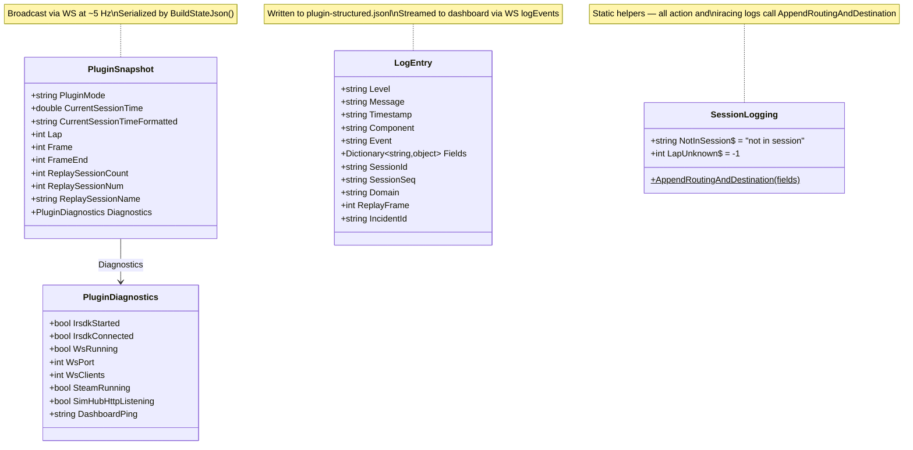
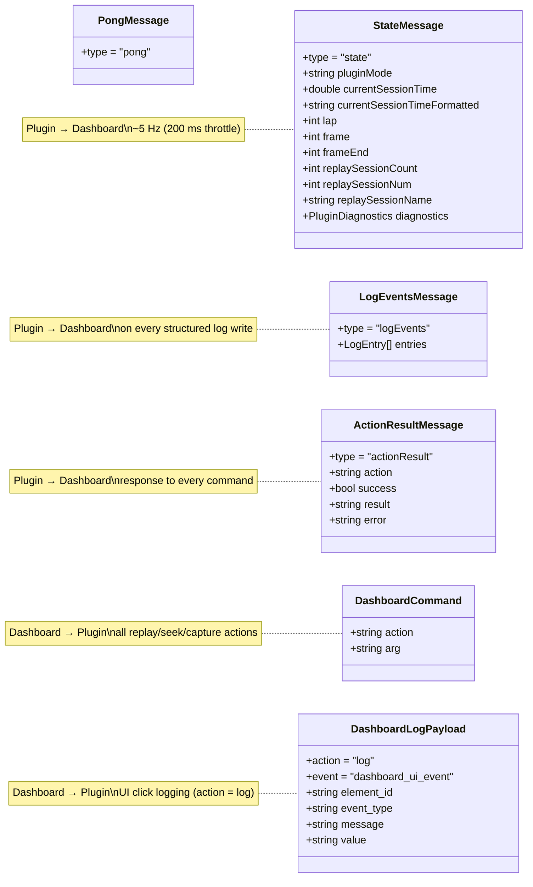
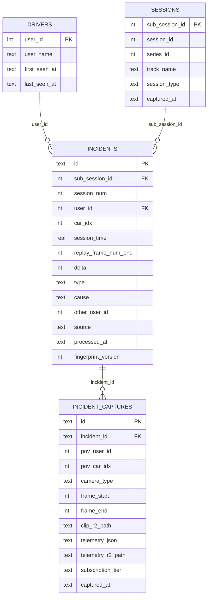
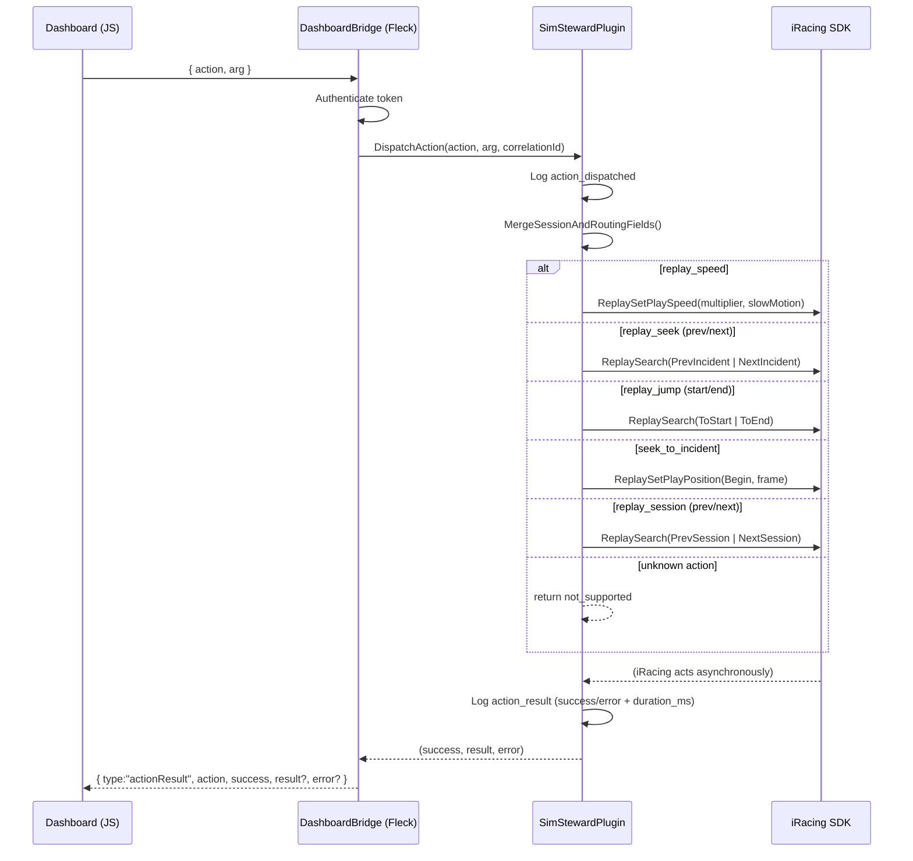
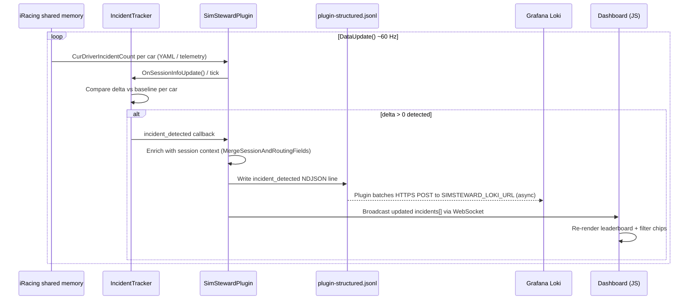
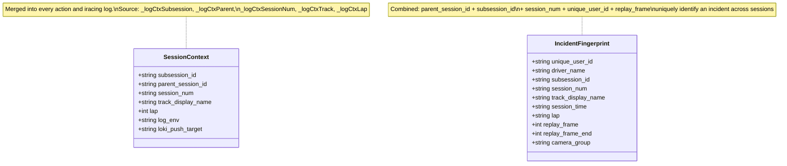

# Sim Steward — Architecture & Data Structures

Diagrams covering C# data structures, WebSocket message contracts, data API schema, and runtime communication flows.

---

## C# Plugin — Core Data Structures

Classes that drive the WebSocket state broadcast and structured logging.

---

## WebSocket Message Contract

All messages exchanged between plugin and dashboard over port 19847.

---

## Observability Egress (Security & CORS)

**CRITICAL RULE:** The SimHub Dashboard (client-side JS) must **NEVER** make direct HTTP/API requests to external observability platforms (e.g., Grafana Loki, Cloudflare).

*   **Why?**
    1.  **Security:** Doing so would require embedding sensitive API tokens (like `SIMSTEWARD_LOKI_TOKEN`) directly into the client-side JavaScript, where anyone could extract them.
    2.  **CORS:** Browsers will block cross-origin requests from the local SimHub web server (`localhost:8888`) to external domains unless complex and insecure CORS policies are configured on the destination server.
*   **The Solution:** The dashboard must route all observability intents (like capturing an incident) through the WebSocket to the C# Plugin. The C# Plugin acts as a secure backend, utilizing `PluginLogger` to batch and execute the HTTPS POST requests to `SIMSTEWARD_LOKI_URL` from a trusted server environment.

---

## Data API Schema

Cloudflare Worker + D1 (mirrors local Flask + SQLite). Applied from `worker/schema.sql`.

---

## Action Dispatch — Sequence

How a dashboard button press travels through the stack and returns a result.

---

## Incident Detection — Sequence

How iRacing incidents flow from SDK shared memory to the dashboard leaderboard and Loki.

---

## Session Context Fields

Fields injected into every `action_dispatched`, `action_result`, and `iracing_incident` log via `MergeSessionAndRoutingFields()`. All fall back to `"not in session"` when iRacing is not connected.

---

## ContextStream KB links

| Spec | Doc ID |
|------|--------|
| Sim Steward — Data Routing (OTel / Loki / Prometheus) | `cbae1c33-c778-4e9a-9a8d-6b3e3c8c368b` |
| Troubleshooting | `88274879-cd2d-4d86-9766-c86b88f95cfe` |
| Observability — Scaling | `99bd9e71-2b08-4eea-b2d4-f7bb22b38af0` |
| Sim Steward — User Flows | `3eb2ceb5-f859-417b-a7e4-8dde05493d55` |
| Sim Steward — User Features (PM) | `c5157521-3681-4432-9c44-a49d8ee3a955` |
