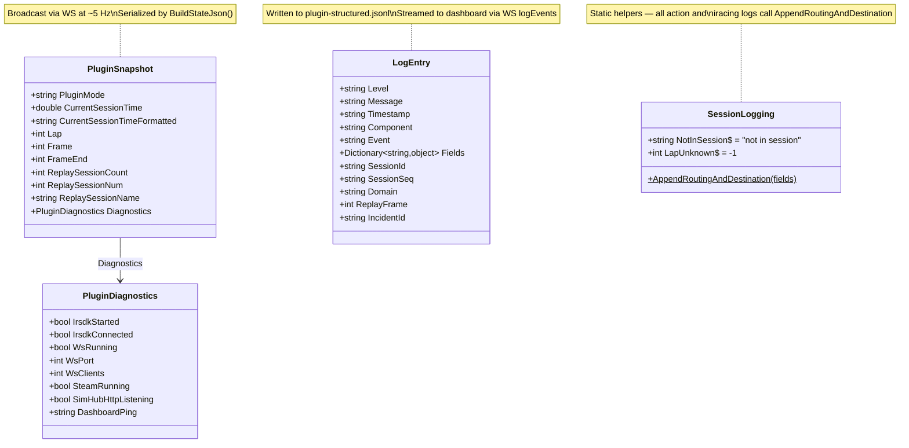
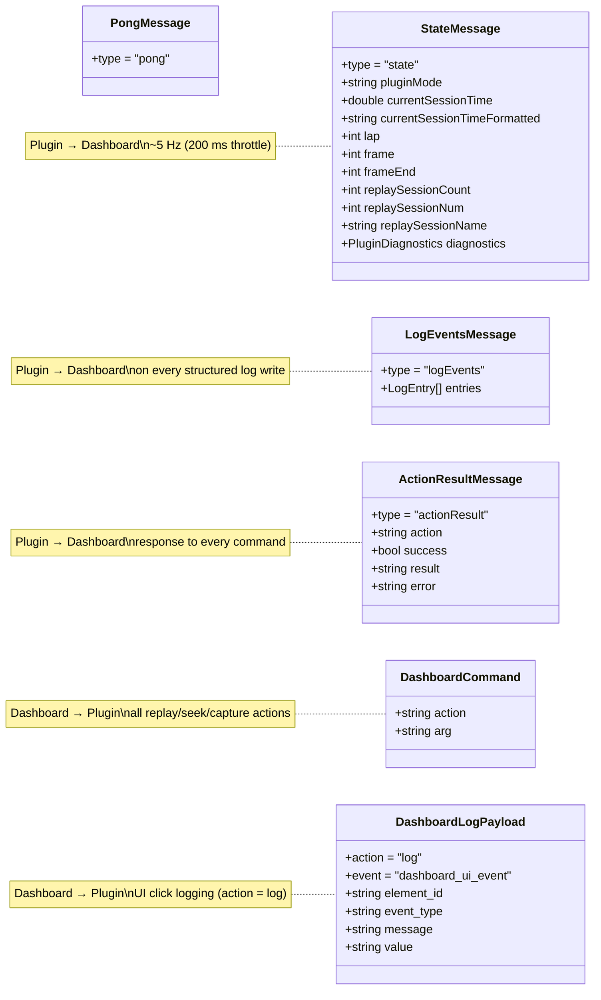
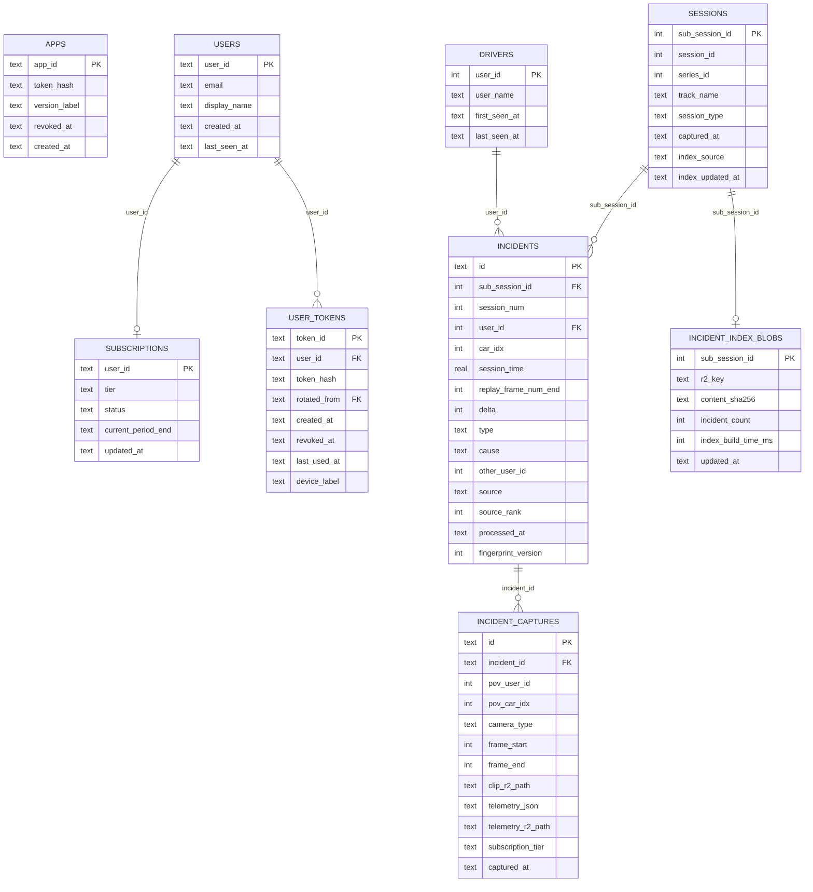
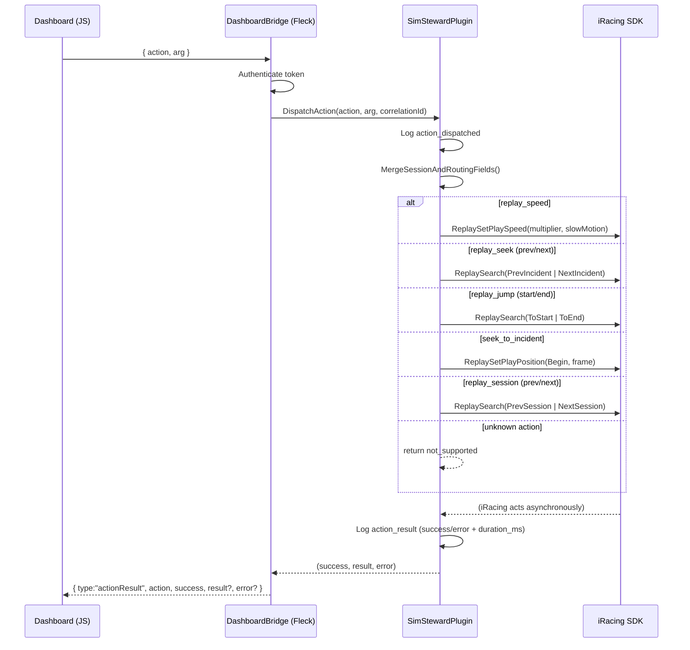
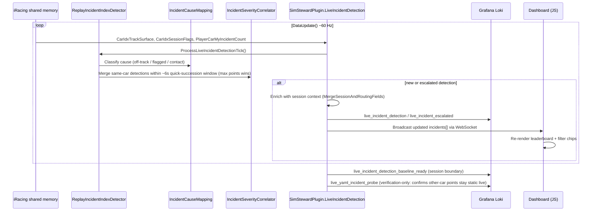
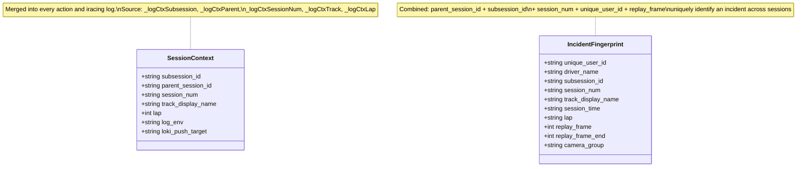

# Sim Steward — Architecture & Data Structures

Diagrams covering C# data structures, WebSocket message contracts, data API schema, and runtime communication flows.

---

## Code map (search anchor)

`SimStewardPlugin` is a **partial class** split across several files (same type, compile-time merge). Use this table to jump from a concern to source.

| Subsystem | Primary paths | Role |
|-----------|---------------|------|
| Plugin host, lifecycle, WebSocket server, action dispatch | `src/SimSteward.Plugin/SimStewardPlugin.cs` | `IPlugin` / `IDataPlugin` entry, Fleck WS, `DispatchAction`, snapshot broadcast |
| Live + replay incident detection | `src/SimSteward.Plugin/SimStewardPlugin.Incidents.cs` | YAML deltas, incident logging, replay search hooks |
| Replay incident index (data) | `src/SimSteward.Plugin/SimStewardPlugin.ReplayIncidentIndex.cs`, `SimStewardPlugin.ReplayIncidentIndexBuild.cs` | Index build, TR-019-style payloads |
| Replay incident index (dashboard / WS actions) | `src/SimSteward.Plugin/SimStewardPlugin.ReplayIncidentIndexDashboard.cs` | WS actions for index UI |
| Data capture suite (SDK / Loki verification) | `src/SimSteward.Plugin/SimStewardPlugin.DataCaptureSuite.cs` | Capture-suite actions and plumbing |
| Dashboard UI (SimHub HTTP) | `src/SimSteward.Dashboard/index.html` (includes Replay Index tab, `#log-replayindex`), `data-capture-suite.html` | Browser ES6+ clients; WS to plugin on `SIMSTEWARD_WS_PORT` |
| Structured logging / Loki | `SessionLogging`, sinks under `src/SimSteward.Plugin/` (see [GRAFANA-LOGGING.md](GRAFANA-LOGGING.md)) | JSONL + optional Loki push |

---

## C# Plugin — Core Data Structures

Classes that drive the WebSocket state broadcast and structured logging.

```mermaid
classDiagram
  class PluginSnapshot {
    +string PluginMode
    +double CurrentSessionTime
    +string CurrentSessionTimeFormatted
    +int Lap
    +int Frame
    +int FrameEnd
    +int ReplaySessionCount
    +int ReplaySessionNum
    +string ReplaySessionName
    +PluginDiagnostics Diagnostics
  }
  class PluginDiagnostics {
    +bool IrsdkStarted
    +bool IrsdkConnected
    +bool WsRunning
    +int WsPort
    +int WsClients
    +bool SteamRunning
    +bool SimHubHttpListening
    +string DashboardPing
  }
  class LogEntry {
    +string Level
    +string Message
    +string Timestamp
    +string Component
    +string Event
    +Dictionary~string,object~ Fields
    +string SessionId
    +string SessionSeq
    +string Domain
    +int ReplayFrame
    +string IncidentId
  }
  class SessionLogging {
    +string NotInSession$ = "not in session"
    +int LapUnknown$ = -1
    +AppendRoutingAndDestination(fields)$
  }
  PluginSnapshot --> PluginDiagnostics : Diagnostics
  note for PluginSnapshot "Broadcast via WS at ~5 Hz\nSerialized by BuildStateJson()"
  note for LogEntry "Written to plugin-structured.jsonl\nStreamed to dashboard via WS logEvents"
  note for SessionLogging "Static helpers — all action and\niracing logs call AppendRoutingAndDestination"
```

---

## WebSocket Message Contract

All messages exchanged between plugin and dashboard over port 19847.

```mermaid
classDiagram
  direction LR

  class StateMessage {
    +type = "state"
    +string pluginMode
    +double currentSessionTime
    +string currentSessionTimeFormatted
    +int lap
    +int frame
    +int frameEnd
    +int replaySessionCount
    +int replaySessionNum
    +string replaySessionName
    +PluginDiagnostics diagnostics
  }
  class LogEventsMessage {
    +type = "logEvents"
    +LogEntry[] entries
  }
  class ActionResultMessage {
    +type = "actionResult"
    +string action
    +bool success
    +string result
    +string error
  }
  class PongMessage {
    +type = "pong"
  }
  class DashboardCommand {
    +string action
    +string arg
  }
  class DashboardLogPayload {
    +action = "log"
    +event = "dashboard_ui_event"
    +string element_id
    +string event_type
    +string message
    +string value
  }

  note for StateMessage "Plugin → Dashboard\n~5 Hz (200 ms throttle)"
  note for LogEventsMessage "Plugin → Dashboard\non every structured log write"
  note for ActionResultMessage "Plugin → Dashboard\nresponse to every command"
  note for DashboardCommand "Dashboard → Plugin\nall replay/seek/capture actions"
  note for DashboardLogPayload "Dashboard → Plugin\nUI click logging (action = log)"
```

---

## Observability Egress (Security & CORS)

**CRITICAL RULE:** The SimHub Dashboard (client-side JS) must **NEVER** make direct HTTP/API requests to external observability platforms (e.g., Grafana Loki, Cloudflare).

*   **Why?**
    1.  **Security:** Doing so would require embedding sensitive API tokens (like `SIMSTEWARD_LOKI_TOKEN`) directly into the client-side JavaScript, where anyone could extract them.
    2.  **CORS:** Browsers will block cross-origin requests from the local SimHub web server (`localhost:8888`) to external domains unless complex and insecure CORS policies are configured on the destination server.
*   **The Solution:** The dashboard must route all observability intents (like capturing an incident) through the WebSocket to the C# Plugin. The C# Plugin acts as a secure backend: **`PluginLogger`** persists structured lines to **`plugin-structured.jsonl`** (and mirrors them over WebSocket). **Loki HTTP push of those lines is not implemented in-process in this repo yet** — use an external shipper tailing the JSONL file, or **`send-deploy-loki-marker.ps1`** for deploy-only markers when `SIMSTEWARD_LOKI_URL` is set.

---

## Data API Schema

Cloudflare Worker with **hybrid D1 + R2** storage, applied from `worker/schema.sql`. D1 holds the queryable relational rows below; R2 holds the full-fidelity `ReplayIncidentIndexFileRoot` JSON blob (key `incident-index/v1/{subSessionId}.json`), of which `INCIDENT_INDEX_BLOBS` is the D1-side pointer/manifest. Short-lived device-pairing state lives in KV (not D1). Full design: `docs/superpowers/specs/2026-07-19-cloudflare-incident-storage-design.md`.

**Auth boundary.** The data-plane tables are written/read only through routes gated by our own JWT (`Authorization: Bearer <access_token>`, minted from a rotating `user_token` via device pairing). The human pages (`/approve`, `/admin/*`) that mutate `USERS`/`SUBSCRIPTIONS` are gated by **Cloudflare Access** (email OTP), verified against Cloudflare's JWKS — a separate system from our JWT, never mixed. Incident rows carry `source`/`source_rank` (1=live, 2=replay_reconciled); the D1 upsert is rank-gated so a replay-reconciled write wins over a live one and never regresses. `APPS`, `USERS`, `SUBSCRIPTIONS`, and `USER_TOKENS` back the multi-tenant auth model; `USER_TOKENS` rotates on every exchange (`rotated_from` chain) for replay/theft detection.

```mermaid
erDiagram
  APPS {
    text app_id PK
    text token_hash
    text version_label
    text revoked_at
    text created_at
  }
  USERS {
    text user_id PK
    text email
    text display_name
    text created_at
    text last_seen_at
  }
  SUBSCRIPTIONS {
    text user_id PK
    text tier
    text status
    text current_period_end
    text updated_at
  }
  USER_TOKENS {
    text token_id PK
    text user_id FK
    text token_hash
    text rotated_from FK
    text created_at
    text revoked_at
    text last_used_at
    text device_label
  }
  DRIVERS {
    int user_id PK
    text user_name
    text first_seen_at
    text last_seen_at
  }
  SESSIONS {
    int sub_session_id PK
    int session_id
    int series_id
    text track_name
    text session_type
    text captured_at
    text index_source
    text index_updated_at
  }
  INCIDENTS {
    text id PK
    int sub_session_id FK
    int session_num
    int user_id FK
    int car_idx
    real session_time
    int replay_frame_num_end
    int delta
    text type
    text cause
    int other_user_id
    text source
    int source_rank
    text processed_at
    int fingerprint_version
  }
  INCIDENT_INDEX_BLOBS {
    int sub_session_id PK
    text r2_key
    text content_sha256
    int incident_count
    int index_build_time_ms
    text updated_at
  }
  INCIDENT_CAPTURES {
    text id PK
    text incident_id FK
    int pov_user_id
    int pov_car_idx
    text camera_type
    int frame_start
    int frame_end
    text clip_r2_path
    text telemetry_json
    text telemetry_r2_path
    text subscription_tier
    text captured_at
  }
  USERS ||--o| SUBSCRIPTIONS : "user_id"
  USERS ||--o{ USER_TOKENS : "user_id"
  DRIVERS ||--o{ INCIDENTS : "user_id"
  SESSIONS ||--o{ INCIDENTS : "sub_session_id"
  SESSIONS ||--o| INCIDENT_INDEX_BLOBS : "sub_session_id"
  INCIDENTS ||--o{ INCIDENT_CAPTURES : "incident_id"
```

---

## Action Dispatch — Sequence

How a dashboard button press travels through the stack and returns a result.

```mermaid
sequenceDiagram
  participant D as Dashboard (JS)
  participant WS as DashboardBridge (Fleck)
  participant P as SimStewardPlugin
  participant IR as iRacing SDK

  D->>WS: { action, arg }
  WS->>WS: Authenticate token
  WS->>P: DispatchAction(action, arg, correlationId)
  P->>P: Log action_dispatched
  P->>P: MergeSessionAndRoutingFields()

  alt replay_speed
    P->>IR: ReplaySetPlaySpeed(multiplier, slowMotion)
  else replay_seek (prev/next)
    P->>IR: ReplaySearch(PrevIncident | NextIncident)
  else replay_jump (start/end)
    P->>IR: ReplaySearch(ToStart | ToEnd)
  else seek_to_incident
    P->>IR: ReplaySetPlayPosition(Begin, frame)
  else replay_session (prev/next)
    P->>IR: ReplaySearch(PrevSession | NextSession)
  else unknown action
    P-->>P: return not_supported
  end

  IR-->>P: (iRacing acts asynchronously)
  P->>P: Log action_result (success/error + duration_ms)
  P-->>WS: (success, result, error)
  WS-->>D: { type:"actionResult", action, success, result?, error? }
```

---

## Incident Detection — Sequence

How iRacing incidents flow from SDK shared memory to the dashboard leaderboard and Loki.

**Platform availability** (what YAML exposes per car in live vs replay vs post-results) is documented in [docs/IRACING-DATA-AVAILABILITY.md](IRACING-DATA-AVAILABILITY.md). Live detection runs on per-tick telemetry (`CarIdxTrackSurface` off-track, `CarIdxSessionFlags` per-car flags, `PlayerCarMyIncidentCount` for the player's own points); other cars' official incident points are **not** available live — `Sessions[].ResultsPositions[].Incidents` does not update progressively during a live session, so those resolve only via the replay/results path.

```mermaid
sequenceDiagram
  participant IR as iRacing shared memory
  participant Det as ReplayIncidentIndexDetector
  participant Cause as IncidentCauseMapping
  participant Corr as IncidentSeverityCorrelator
  participant P as SimStewardPlugin.LiveIncidentDetection
  participant Loki as Grafana Loki
  participant D as Dashboard (JS)

  loop DataUpdate() ~60 Hz
    IR->>P: CarIdxTrackSurface, CarIdxSessionFlags, PlayerCarMyIncidentCount
    P->>Det: ProcessLiveIncidentDetectionTick()
    Det->>Cause: Classify cause (off-track / flagged / contact)
    Det->>Corr: Merge same-car detections within ~6s quick-succession window (max points wins)
    alt new or escalated detection
      P->>P: Enrich with session context (MergeSessionAndRoutingFields)
      P->>Loki: live_incident_detection / live_incident_escalated
      P->>D: Broadcast updated incidents[] via WebSocket
      D->>D: Re-render leaderboard + filter chips
    end
  end
  P->>Loki: live_incident_detection_baseline_ready (session boundary)
  P->>Loki: live_yaml_incident_probe (verification-only: confirms other-car points stay static live)
```

The replay path (`SimStewardPlugin.ReplayIncidentIndexBuild.cs`) runs the same `ReplayIncidentIndexDetector` against replay-driven ticks, and additionally resolves authoritative per-car points from the session YAML via `ReplayIncidentYamlDiff`/`ReplayIncidentIndexResultsYaml` once results are final, emitting `replay_incident_index_detection` and `replay_index_ff_yaml_snapshot`.

---

## Session Context Fields

Fields injected into every `action_dispatched`, `action_result`, and `iracing_incident` log via `MergeSessionAndRoutingFields()`. All fall back to `"not in session"` when iRacing is not connected.

```mermaid
classDiagram
  class SessionContext {
    +string subsession_id
    +string parent_session_id
    +string session_num
    +string track_display_name
    +int lap
    +string log_env
    +string loki_push_target
  }
  class IncidentFingerprint {
    +string unique_user_id
    +string driver_name
    +string subsession_id
    +string session_num
    +string track_display_name
    +string session_time
    +string lap
    +int replay_frame
    +int replay_frame_end
    +string camera_group
  }
  note for SessionContext "Merged into every action and iracing log.\nSource: _logCtxSubsession, _logCtxParent,\n_logCtxSessionNum, _logCtxTrack, _logCtxLap"
  note for IncidentFingerprint "Combined: parent_session_id + subsession_id\n+ session_num + unique_user_id + replay_frame\nuniquely identify an incident across sessions"
```

