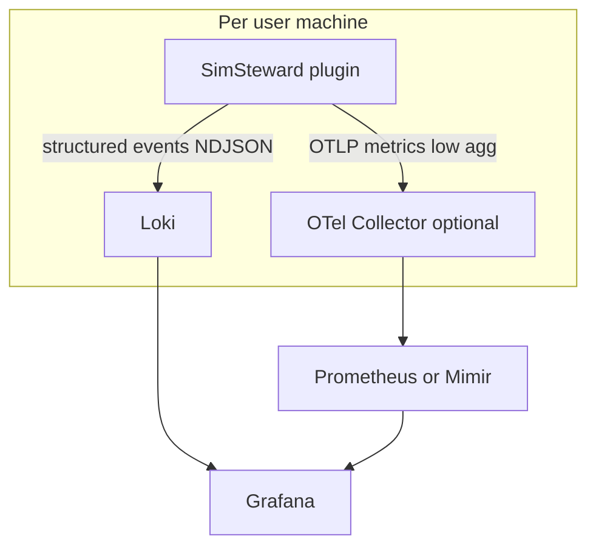

# Data routing: OTel vs Loki vs Prometheus (and scale at ~1k users)

**Purpose:** Single place for *what data goes to which backend*, *why*, and *rough sizing* when many users share one Grafana stack. Detail on Loki labels and events: **docs/GRAFANA-LOGGING.md**. Scaling patterns: **docs/observability-scaling.md**. SDK variable names: **docs/IRACING-TELEMETRY.md**.

---

## 1. Routing decisions (approved)

These are the **intended** paths for SimSteward observability data. Implementation may lag; this doc is the **target architecture**.

| Decision | Choice |
|----------|--------|
| **Domain events** (incidents, actions, session summaries, digests, lifecycle) | **Loki** (structured logs / NDJSON → HTTP push). |
| **Low-rate resource / health** (`host_resource_sample`, plugin lifecycle) | **Loki** today; optional **Prometheus/Mimir gauges** later for native SLO-style alerts on CPU/memory. |
| **High-frequency / per-tick car telemetry** (e.g. 60 Hz channels, per-car arrays) | **Not** primary path to Loki. **OpenTelemetry metrics** (in-process SDK → OTLP) → **Prometheus-compatible** backend (**Prometheus** or **Grafana Mimir**). |
| **Traces** (spans across plugin + backend) | Optional **OTel traces** → Tempo/Jaeger — **not** required for v1. |

**OpenTelemetry** here means **instrumentation and export** (SDK + OTLP), not a storage product. Storage is whatever backs metrics (Prometheus, Mimir, etc.) and optionally Tempo/Loki depending on collector config.

**Grafana** is the visualization layer; it is not the scaling bottleneck.

---

## 2. Decision matrix

| Data class | Examples | Target | Rationale |
|------------|----------|--------|-----------|
| **Domain events** | `incident_detected`, `action_result`, `session_end_datapoints_*`, `session_digest` | **Loki** | Irregular, rich JSON; query by `event` + body fields. |
| **Low-rate resource / health** | `host_resource_sample`, `plugin_ready` | **Loki**; optional duplicate as **gauges** in Prom/Mimir | Loki is fine at ~1/min; Prom better for alert rules on % CPU / memory. |
| **Car / sim telemetry (high rate)** | Per-tick `Speed`, `RPM`, tire temps, `CarIdx*` arrays at 60 Hz | **OTel metrics** → **Prometheus/Mimir** | Time-series shape; aggregation, downsampling, rates — not log lines. |
| **Traces** | Optional spans | **OTel** → Tempo | Adds complexity; defer until needed. |

---

## 3. Architecture sketch

---

## 4. Rough sizing at ~1k users

### 4.1 Loki (logs)

**Per-user log budget (order of magnitude)** — from **docs/GRAFANA-LOGGING.md** volume table (~2 h session):

- ~**0.23 MB** per session (event-driven; no per-tick logging).
- If a heavy user runs ~**30 sessions/month** → ~**7 MB/user/month** (0.23 × 30).

**~1k users (all active, similar usage):**

- **~7 GB/month** ingested logs (1000 × 7 MB), **order-of-magnitude** before deduplication, sampling, or varying usage.
- **Ingestion rate:** Batches are small (&lt; 20 KB typical); total **MB/s** depends on how many users peak at once — size the **tenant** (ingestion cap, storage, retention) to **users × peak sessions × batch frequency**, not average only.
- **Streams:** With the **4-label schema** ( **docs/GRAFANA-LOGGING.md** ), active streams stay **≪ 5,000**; the risk is **total GB/month** and **MB/s**, not stream count.

**Grafana Cloud free tier** (indicative: **~50 GB/month**, **5 MB/s**, **14-day** retention — see **docs/GRAFANA-LOGGING.md**): ~1k full-time users with the stated per-session budget can **exceed** “hobby” comfort without a **sizing pass**. Treat **paid** Grafana Cloud capacity or **self-hosted** Loki as a **billing/ops** decision once user counts and session rates are known.

### 4.2 Prometheus / Mimir (metrics)

**Risk at scale:** **Cardinality** — not Grafana UI.

- **Do not** put `user_id`, `session_id`, or `car_idx` on **every** series as labels → millions of series → cost and slow queries.
- **Do:** Low-cardinality labels (`env`, `region`, `app`, `tier`); aggregate at **OTel collector** or edge; put high-cardinality IDs in **exemplars**, **logs** (Loki), or **recording rules**.

### 4.3 What breaks at ~1k users

| Anti-pattern | Effect |
|--------------|--------|
| Per-tick car telemetry as **Loki** log lines | Volume and query cost explode; fights Loki’s model. |
| High-cardinality **labels** on metrics | Prometheus/Mimir series explosion. |
| Assuming **free tier** limits = production headroom | May need paid or self-hosted **before** launch at volume. |

---

## 5. Metric taxonomy: car telemetry (OTel vs Loki)

**Rule of thumb:** Anything sampled or emitted **every tick** (~60 Hz) or **per-car per-tick** belongs in the **OTel metrics → Prometheus/Mimir** path when exported — **not** as a high-rate Loki log stream.

### 5.1 OTel metrics path (when implemented)

**Candidate signals** (names are illustrative; align with OTel semantic conventions when implementing):

| Category | SDK variables (see **docs/IRACING-TELEMETRY.md**) | Notes |
|----------|-----------------------------------------------------|--------|
| **Motion / driver** | `Speed`, `RPM`, `Throttle`, `Brake`, `Clutch`, `Gear`, `SteeringWheelAngle`, `LatAccel`, `LongAccel`, `VertAccel`, `Yaw`/`Pitch`/`Roll`/`YawRate`… | Export **aggregated** or **downsampled** (e.g. 1–5 Hz) with **low-cardinality** labels only. |
| **Tires** | `LFtempCL/CM/CR`, …, `{c}pressure`, `{c}wear*`, `{c}rideHeight` | Per-corner; avoid per-session labels on every series. |
| **Engine / fuel** | `FuelLevel`, `FuelLevelPct`, `FuelUsePerHour`, `OilTemp`, `WaterTemp`, `ManifoldPress`, … | Gauges / rates. |
| **Lap / position** | `LapDistPct`, `Lap`, `LapCurrentLapTime`, `LapLastLapTime`, `LapBestLapTime` | Histograms or gauges depending on use case. |
| **Per-car arrays** | `CarIdxLap`, `CarIdxPosition`, `CarIdxRPM`, `CarIdxGear`, `CarIdxLapDistPct`, … | **High cardinality** if labeled per car per user — prefer **aggregation** (e.g. leader lap, player car only) or **sampled** subset. |

**Implementation guardrails:** Max export rate (e.g. 1–5 Hz), bounded metric count, no `session_id` as a required label on every series.

### 5.2 Loki path (session-scoped / event-only)

These stay **events or throttled snapshots** in structured logs — **not** a mirror of full 60 Hz telemetry:

| Kind | Examples already in **docs/GRAFANA-LOGGING.md** |
|------|-----------------------------------------------|
| **Incidents** | `incident_detected` — YAML delta, replay context in JSON body. |
| **Session / results** | `session_end_datapoints_session`, `session_end_datapoints_results`, `session_digest`, `session_summary_captured`. |
| **Actions** | `action_dispatched`, `action_result`, `dashboard_ui_event` (when enabled). |
| **Health** | `host_resource_sample` (~1/min). |
| **Telemetry in logs** | **Single snapshot** fields on session-end events (e.g. `telemetry_*` at capture) — **not** continuous per-tick streams. |

### 5.3 Summary

| Telemetry style | Backend |
|-----------------|--------|
| Continuous high-rate channels | **OTel metrics → Prometheus/Mimir** (future). |
| Events, boundaries, chunked session results, resource samples | **Loki** (current design). |

---

## 6. Follow-ups (implementation)

- Define **metric names, units, and max export rate** for the first OTel slice (e.g. player car only).
- Choose **Mimir vs Prometheus** for long-term multi-tenant scale.
- Add **budget alerts** on Loki ingestion GB/day before stepping up user counts.

---

## References

- **docs/GRAFANA-LOGGING.md** — Loki schema, volume table, events.
- **docs/observability-scaling.md** — Many users, central Loki, label rules.
- **docs/IRACING-TELEMETRY.md** — SDK variables and categories.
- Grafana: [Loki label best practices](https://grafana.com/docs/loki/latest/get-started/labels/bp-labels/), [Prometheus cardinality](https://grafana.com/docs/grafana-cloud/send-data/metrics/metricsCardinality/).
