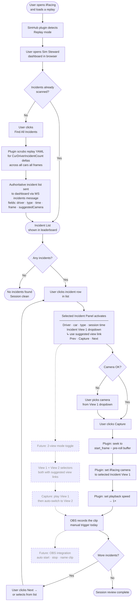

# Sim Steward — Product Flow

**PM summary (feature buckets and how pieces connect):** [USER-FEATURES-PM.md](USER-FEATURES-PM.md)

**User flows (step-by-step journeys through today's UI):** [USER-FLOWS.md](USER-FLOWS.md)

## Problem

Reviewing a race in iRacing replay means manually scrubbing through footage to find incidents, then adjusting camera angles, then recording each clip. For a typical race this takes 20–40 minutes of tedious setup per session.

Sim Steward eliminates that. It turns a replay session into a structured review queue: find all incidents instantly, jump to each one in sequence, frame the right camera, and capture — ready for editing or review.

---

## User Flow Diagram



---

## Feature Maturity

| Feature | Status | Notes |
|---|---|---|
| Replay mode detection | ✅ shipped | SimMode YAML field |
| Status bar (mode / time / WS / diag dots) | ✅ shipped | |
| Replay transport (jump / speed / play-pause) | ✅ shipped | Scrub bar seek is PoC / toast only |
| Prev / Next replay incident (`replay_seek`) | ✅ shipped | Session-wide replay jump, not telemetry-car scoped |
| Jump to incident frame | ✅ shipped | `seek_to_incident` action |
| Incident leaderboard + severity filters | ✅ shipped | All / 1× / 2× / 4× / Mine chips |
| Incident meta strip (selected detail) | ✅ shipped | Click-to-expand/collapse; frame · car · driver · sev · cause |
| This driver's incidents (left panel) | ✅ shipped | Filters by selected car — **distinct from Mine filter** (see PM issues) |
| Captured incidents tab + group-by-driver accordion | ✅ shipped | |
| Find driver incidents (scan walk) | ✅ shipped | Walks already-known leaderboard frames; frame handshake + step delay between seeks |
| Find all session incidents (scan walk) | ✅ shipped | Same walk for all drivers; confirm dialog |
| Driver standings (collapsible) | ✅ shipped | |
| Telemetry strip (throttle / brake / steering) | ✅ shipped | From plugin `state.telemetry` when present; else mock when disconnected |
| Telemetry car selection | ✅ shipped | `drivers` in WS state; gauges follow live telemetry when connected |
| Duplicate prev/next replay incident buttons | ✅ shipped | Duplicate row removed; only Replay Controls retains prev/next |
| Scrub bar seek | ⚠️ PoC | Shows toast only; not wired to seek action |
| Find All Incidents (true YAML scan) | ❌ missing | Walks leaderboard frames only, not a plugin-side YAML scan |
| Selected Incident Panel (camera + capture UI) | ✅ shipped | Camera selector, capture, prev/next; meta strip still available |
| Camera list from plugin (`cameraGroups`) | ✅ shipped | In WS state |
| `suggestedCamera` field on incident | ⚠️ partial | Dashboard heuristic from `cause` + `cameraGroups`; not from plugin YAML |
| `set_camera` plugin action | ✅ shipped | |
| `capture_incident` atomic action | ✅ shipped | Pre-roll seek + optional camera + 1× speed |
| Car dropdown from live plugin data | ✅ shipped | `drivers` in state |
| Pre-roll buffer on capture | ✅ shipped | `CapturePreRollFrames` in plugin |
| 1× playback enforced on capture | ✅ shipped | `ReplaySetPlaySpeed(1, false)` in `capture_incident` |
| Dual-view capture (View 1 + View 2) | 🗓 future | Two selectors, auto-switch mid-clip |
| OBS integration | 🗓 future | Auto record/stop/name per incident |

### Remaining gaps (narrow follow-ups)

- **True YAML scan:** Plugin-side scan of replay / session YAML for all incidents (replaces walking the leaderboard-only list).
- **Scrub bar:** Wire seek to `seek_to_incident` or replay position (currently toast-only PoC).
- **Plugin-owned `suggestedCamera`:** Emit per incident from telemetry/YAML instead of dashboard heuristic.
- **Telemetry in state:** Ensure plugin broadcasts `telemetry` in every `state` message when iRacing connected so car changes always reflect live gauges (optional hardening).
- **PM issues:** Meta strip vs left-column feedback (issue 5); Captured-tab value vs OBS (issue 4).

---

## Incident Card — Target State

The incident list rows are read-only. Clicking a row activates the **Selected Incident Panel** — a persistent area above or beside the list that shows full context and controls.

```
INCIDENT LIST (scrollable rows)
┌────────────────────────────────────────┐
│  #99  J. Smith    contact   4×  0:43  │  ← clicked → activates panel below
│  #12  A. Jones    wall      2×  0:41  │
│  #42  B. Lee      off-track 1×  0:38  │
└────────────────────────────────────────┘

SELECTED INCIDENT PANEL
┌──────────────────────────────────────────────────────┐
│  #99  J. Smith              4×  contact   0:43:12    │
│  ──────────────────────────────────────────────────  │
│  Incident View 1:  [ Chase Camera            ▼ ]     │
│                    use suggested view ↗               │
│                                                      │
│  ·  ·  ·  (future — 2-view mode)  ·  ·  ·           │
│  Incident View 2:  [ TV Camera 2             ▼ ]     │
│                    use suggested view ↗               │
│                                                      │
│       [ ← Prev ]      [ ▶ Capture ]      [ Next → ] │
└──────────────────────────────────────────────────────┘
```

**Capture** triggers one atomic action on the plugin:
1. Seek to `start_frame − PRE_ROLL_FRAMES`
2. Set camera to selected Incident View 1
3. Set playback speed to 1×

User then watches it play and OBS records. They press **Next →** when done.

---

## What still needs to change (backlog)

### Plugin (C#)

| Change | Why |
|---|---|
| Add `suggestedCamera` on server-owned incidents | When incidents come from plugin/YAML, pre-fill View 1 without heuristics |
| Replace leaderboard walk with true YAML scan | Full discovery; today’s walk only revisits frames already in the list |

### Dashboard (JS)

| Change | Why |
|---|---|
| Optional: frame handshake tuning | `waitForFrameApprox` tolerance/timeouts per machine |
| Keep "This driver's incidents" left-col panel | **Not redundant** — Mine chip = `player:true` (your car only); driver panel = any selected car; required for steward opponent review |

---

## PM flow issues (open)

> Detailed flows with diagrams: [USER-FLOWS.md](USER-FLOWS.md)

| # | Type | Issue |
|---|------|-------|
| 1 | Resolved | Duplicate replay prev/next removed from Incident navigation |
| 2 | Resolved | Car dropdown populated from plugin `drivers` |
| 3 | Mitigated | Capture walk waits for `state.frame` ≈ seek target (`waitForFrameApprox`); fallback on timeout |
| 4 | Value gap | Captured tab is still leaderboard subset + timestamp until OBS workflow |
| 5 | UX gap | Meta strip in bottom dock vs feedback near left-column driver clicks |
| 6 | Product decision (resolved) | "This driver's incidents" is **not** equivalent to Mine chip — keep it |
| 7 | Mitigated | Buttons renamed to “Walk … listed incidents” with tooltips clarifying no YAML discovery |
