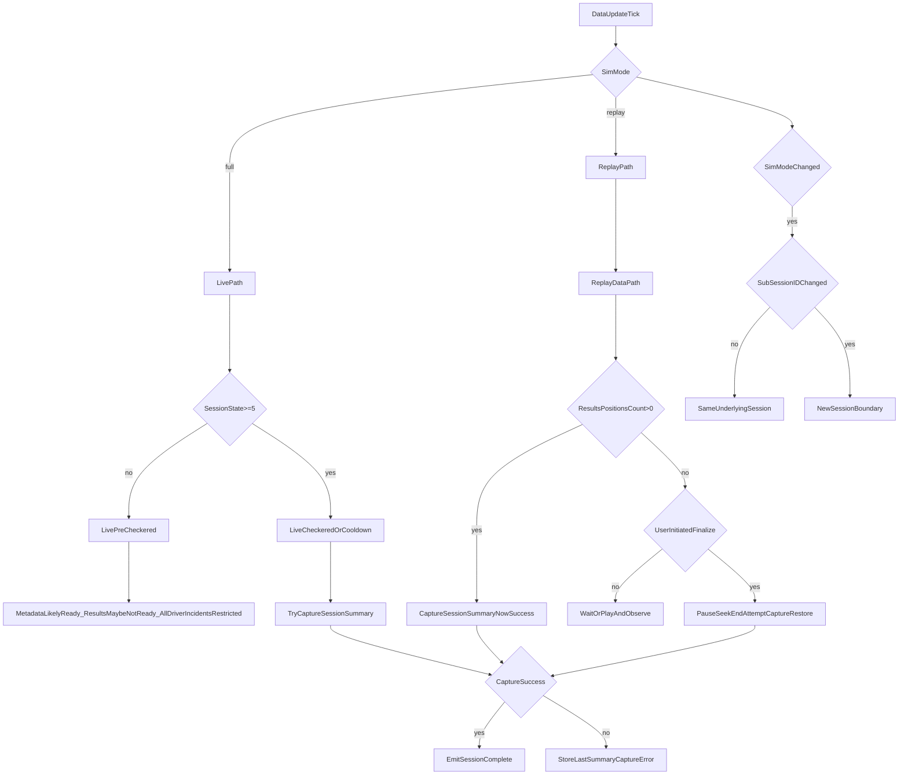

# Session Data Availability (Live vs Replay)

This document captures current understanding of **what iRacing data is available when**, and how SimSteward should interpret it for session summary capture.

## Scope

Focus is on data used for:

- Session metadata (`SessionID`, `SubSessionID`, track/session fields)
- Results table (`ResultsPositions`)
- Incident totals (all drivers)
- Replay-driven capture behavior

## Signals We Observe

From telemetry / YAML:

- `WeekendInfo.SimMode` (`full` vs `replay`)
- `SessionState` (notably checkered/cooldown at `>= 5`)
- `SessionInfoUpdate` (YAML revision counter)
- `SessionInfo.Sessions[].ResultsPositions`
- `DriverInfo.Drivers[].CurDriverIncidentCount`
- `WeekendInfo.SessionID` and `WeekendInfo.SubSessionID`

From plugin state:

- `pluginMode` (`Live`, `Replay`, `Unknown`)
- `sessionDiagnostics.*` (readiness and capture diagnostics)

## Data Availability Matrix

| Context | Metadata (`SessionID`/`SubSessionID`/track) | Results table (`ResultsPositions`) | All-driver incidents (`CurDriverIncidentCount`) | Notes |
|---|---|---|---|---|
| Live session, non-admin, pre-checkered | Usually available once YAML loaded | Often incomplete or not final | Other drivers commonly remain 0 | iRacing admin restriction applies to live non-admin all-driver incidents |
| Live session at checkered/cooldown (`SessionState >= 5`) | Available | Usually finalizes here | More reliable than pre-checkered | Current auto-capture trigger in plugin |
| Replay loaded (full-length source) | Available | May be ready immediately or after replay/YAML progression | Generally available in replay | Must be validated per scenario with snapshots |
| Replay short clip (example: 24s) | Available | May remain not-ready if clip lacks end-state context | Can be partial/incomplete | If not ready, user can run finalize-and-capture |
| Replay after seek-to-end | Available | Highest chance to be ready/final | Highest chance to reflect final totals | Used by user-initiated `FinalizeThenCaptureSessionSummary` |

## Practical Interpretation

1. **Metadata is easiest**: session/track identifiers are usually available as soon as YAML is present.
2. **Results readiness is the key gate**: treat `ResultsPositionsCount > 0` as minimum readiness for summary capture.
3. **Live non-admin limits are real**: all-driver incidents may stay zero until post-race.
4. **Replay is best for complete all-driver totals**, but short clips may not naturally emit final result shape.
5. **Subsession continuity rule**:
   - If `SimMode` flips `full -> replay` and `SubSessionID` stays the same, treat as the same underlying session.
   - If `SubSessionID` changes, treat as a new session.

## Capture Strategy (Current)

- Automatic capture attempt on checkered transition (`SessionState >= 5`).
- User can request immediate capture (`CaptureSessionSummaryNow`).
- If not ready in replay, user can request `FinalizeThenCaptureSessionSummary`:
  - Pause replay
  - Seek to end
  - Attempt capture until ready (bounded)
  - Restore previous position/speed

## Mermaid: Availability + Capture Decision Flow

## What We Still Validate Empirically

Using recorded snapshots (`session-discovery.jsonl`), confirm:

- Whether full-length replay provides ready `ResultsPositions` immediately at load.
- Whether short replay clips can ever become ready without seek-to-end.
- Exact timing relationship among `SessionInfoUpdate`, `SessionState`, and results readiness.

