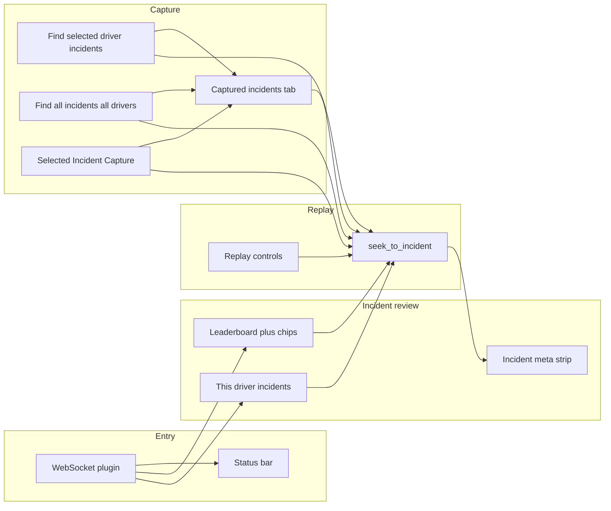

# Sim Steward — User features (PM-style) and how they connect

## Scope

This describes the **browser dashboard** ([`../src/SimSteward.Dashboard/index.html`](../src/SimSteward.Dashboard/index.html)) plus implied **plugin WebSocket** behavior (replay/incidents/telemetry). [PRODUCT-FLOW.md](PRODUCT-FLOW.md) is the source of truth for **shipped vs gap**: the **Selected Incident Panel** (camera + `capture_incident`), **live car list**, and **`set_camera`** are **shipped**; **true YAML scan**, **scrub-bar seek**, **plugin-owned `suggestedCamera`**, **dual-view**, and **OBS** remain **future / partial**. Below still describes how features connect in the UI.

---

## Feature 1 — Session awareness and health (status bar)

**User story:** As a steward, I see whether I’m in replay vs waiting, current session time, dependency lights (iRacing / Steam / SimHub), and WebSocket connectivity so I know the UI is live.

**Flow:** Open dashboard → header shows mode pill, time, dots, WS badge → plugin `state` updates refine these as replay/session data arrives.

**Connects to:** Everything else—if WS is down, scans and seeks may not reach the plugin; dots explain “why nothing moves.”

---

## Feature 2 — Replay transport controls

**User story:** I can jump start/end, change speed, play/pause, step **prev / next replay incident** (session-wide replay jump, not telemetry-car scoped), see frame + scrub bar, and when the replay file has **multiple sessions**, switch **previous / next session** via dedicated buttons.

**Flow:** Use transport buttons → `replay_*` actions over WebSocket → logs in iRacing Events / App Health as implemented → frame label and scrub fill update from `state`. When `replaySessionCount > 1` in `state`, the session row appears and sends `replay_session` (`prev` / `next`) to the plugin.

**Connects to:** **Incident navigation** (telemetry car + scan buttons), **capture scans** (seek to frames), and **leaderboard** (seek when clicking an incident). Session-wide **prev/next replay incident** lives only under **Replay Controls**. Same replay surface, different entry points.

---

## Feature 3 — Telemetry car selection

**User story:** I pick which car the **telemetry strip** and **“This driver’s incidents”** list represent.

**Flow:** Change **Telemetry car** dropdown → options come from plugin `state.drivers` when connected (mock path when disconnected); driver incident list filters by `car`; session-scan capture can rotate this dropdown per incident when scanning the whole session.

**Connects to:** **This driver’s incidents** (left), **Find selected driver’s incidents** (queue built from plugin incident list for **that selected car only**), and **Find all incidents for all drivers** (UI follows each incident’s car during the session scan).

---

## Feature 4 — Incident leaderboard (filtered session list)

**User story:** I see all incidents from the plugin, filter by severity / mine, and use this as the main review list.

**Flow:** Receive `incidents` over WS → list + count refresh → chips filter → click row → **seek** + optional **incident meta strip** (expand/collapse). A second click on the same session incident opens the **Selected Incident Panel** (camera + Capture + prev/next in filtered list).

**Connects to:** **Plugin incident feed** (source of truth); **meta strip** and **Selected Incident Panel** (detail + camera + atomic capture); **capture** flows (same incident objects, different purpose—scan walks build a **second** list in **Captured**; **▶ Capture** uses `capture_incident`).

---

## Feature 5 — This driver’s incidents (left column)

**User story:** Without changing tabs, I see only incidents for the **telemetry car**.

**Flow:** Same incident cards as leaderboard; filtered by selected car; click → same seek + meta strip behavior.

**Connects to:** **Telemetry car** and **leaderboard** (same cards, different scope). PRODUCT-FLOW once suggested removing this as redundant with “Mine”—**product decision still open**; today it’s driver-scoped, not “mine only.”

---

## Feature 6 — Driver standings

**User story:** I see positions, car, driver, incident counts; I can collapse the panel.

**Flow:** Populated from `drivers` in `state` → optional toggle header.

**Connects to:** **Context** for who’s who; not wired to seek/capture directly in the HTML reviewed.

---

## Feature 7 — Bottom telemetry strip

**User story:** I monitor throttle, brake, and steering (gauge + L/R) for the selected car’s telemetry stream.

**Flow:** `telemetryData` / mock path → bars + wheel; steering sign adjusted to match iRacing convention in code.

**Connects to:** **Telemetry car** (what you’re watching); **logs** tab “Telemetry Data” for raw lines—parallel views of the same signal at different granularity.

---

## Feature 8 — Logging / observability tabs

**User story:** I inspect iRacing events, app health, telemetry log lines, with autoscroll control.

**Flow:** Switch tabs → `switchTab` → panes swap; Auto toggles scroll behavior.

**Connects to:** **Operational debugging** next to incident review; structured logging rules ([RULES-ActionCoverage.md](RULES-ActionCoverage.md)) govern what gets emitted when users click controls.

---

## Feature 9 — Incident meta strip (selected incident details)

**User story:** When I **choose** an incident (leaderboard, driver list, or captured row), I can **expand** a detail block under the tabs (frame, car, driver, severity, cause, etc.) and **collapse** by clicking again.

**Flow:** Click card → seek + strip expands; same card again → strip collapses; selection highlights cards where applicable.

**Connects to:** **Leaderboard / driver list / captured** as three entry points into one detail surface; replaces an older dedicated “Incident meta” tab.

---

## Feature 10 — Find selected driver’s incidents (capture)

**User story:** I automatically walk **each incident frame for the selected telemetry car only** (from the session incident list), seek each, and append **captured** records with metadata (PoC timing).

**Flow:** Click **Find selected driver’s incidents** → queue from `incidents` filtered by **selected** car → `seek_to_incident` per frame → delayed snapshot → append to **Captured incidents** → stop or cap.

**Connects to:** **Telemetry car**, **plugin incident list**, **Captured incidents** tab; complements manual clicking through the leaderboard.

---

## Feature 11 — Find all incidents for all drivers (capture)

**User story:** I scan **every** incident for **all drivers** in the session, with a **confirm** dialog, rotating telemetry car in the UI to match each incident as we go.

**Flow:** Click → confirm → queue all unique frames → seek loop → snapshots → **Captured** list grows.

**Connects to:** Same **Captured** destination as driver scan; **broader** scope and **explicit consent**; shares status/stop pattern with driver scan.

---

## Feature 12 — Captured incidents tab

**User story:** I review everything the scan (or sequence) recorded, optionally **group by driver**, and **collapse/expand** per driver group.

**Flow:** Open tab → list from `capturedIncidents` → optional grouping → accordion headers → click row → seek + meta strip (capture path).

**Connects to:** **Capture scans** (producer); **meta strip** (inspection); **group-by-driver** + **accordion** for dense sessions.

**Loki / re-capture:** Each **▶ Capture** on the Selected Incident Panel logs structured **`action_result`** data to Loki (including frame / subsession-style correlation fields). **Loki is append-only**—re-capturing the same frame adds a new line; the dashboard prompts for confirmation before sending again. In Grafana, prefer **latest timestamp** or aggregation for “current” capture per fingerprint; older lines age out with retention.

---

## How the pillars fit together (mermaid)

---

## Vision vs shipped (from PRODUCT-FLOW)

| Area | Today (dashboard) | North-star / gap |
|------|---------------------|-------------------|
| Incident list + seek + filters | Shipped | Aligned |
| Selected detail | Meta strip **and** Selected Incident Panel (camera + Capture) | Dual-view, plugin `suggestedCamera` |
| Capture | Scan walks → **Captured** list; **▶ Capture** → `capture_incident` + Loki fingerprint on `action_result` | OBS integration |
| Scan | Queue seeks from incident list + confirm for session | True YAML scan in plugin |

---

## One-line product narrative

**Sim Steward today** is a **replay-aware incident console**: connect (**WS**), **navigate** the session (**replay + seek**), **focus** a driver (**live car dropdown + lists**), **inspect** details (**meta strip** + **Selected Incident Panel** with camera + **`capture_incident`**), **batch-record** scan snapshots into **Captured** with optional **grouping/accordion**, and stream structured logs to **Loki**—while **telemetry** and **logs** explain what the car and app are doing. **PRODUCT-FLOW** tracks remaining gaps (**YAML scan**, **scrub seek**, **OBS**, richer **suggestedCamera**).

---

## ContextStream KB links

| Spec | Doc ID |
|------|--------|
| Sim Steward — Product Flow | `4f3c6370-0bfc-4f54-9848-9946745ac3d4` |
| Sim Steward — User Flows | `3eb2ceb5-f859-417b-a7e4-8dde05493d55` |
| Sim Steward — Architecture and Data Structures | `c453dd83-dfd9-4002-b8a2-2e0c8a4d032c` |
| Troubleshooting | `88274879-cd2d-4d86-9766-c86b88f95cfe` |
| Sim Steward — Data Routing (OTel / Loki / Prometheus) | `cbae1c33-c778-4e9a-9a8d-6b3e3c8c368b` |
