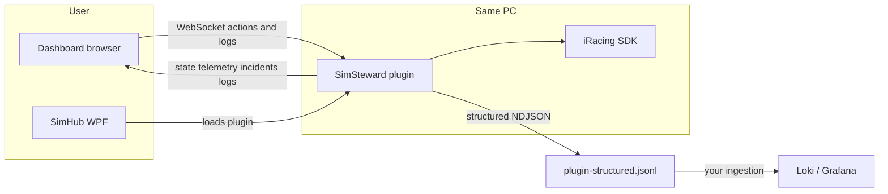

# Sim Steward — user features and flows (PM summary)

This page is the product-manager-style map of user-facing capabilities, the intended replay-review journey, how pieces connect (SimHub / WebSocket / iRacing), and how that relates to [PRODUCT-FLOW.md](PRODUCT-FLOW.md) (shipped vs missing vs future).

## North-star story (what we’re building toward)

From [PRODUCT-FLOW.md](PRODUCT-FLOW.md): the **problem** is slow manual replay review in iRacing. The **solution narrative** is: load a replay → **discover all incidents** into a **review queue** → **jump** incident to incident → **frame the camera** → **capture** clips (today often with OBS manually) → repeat until the session is reviewed.

That doc’s **mermaid diagram** is the canonical “happy path” product story: entry → (optional) **Find All Incidents** scan → **incident list** → **selected incident** controls → **Capture** (seek pre-roll, set camera, 1×) → **Next** / done. It also calls out **future** paths: dual-view capture and **OBS automation** (dashed nodes).

---

## Feature buckets (how to talk about them)

| Bucket | User-facing value | Primary surfaces |
|--------|-------------------|------------------|
| **Connection and trust** | User knows SimHub + plugin + dashboard are alive | Status bar: mode pill, session time, WS badge, diagnostic dots (iRacing, Steam, SimHub HTTP) |
| **Situational awareness** | User sees where they are in the replay | Replay frame / scrub UI, session time, mode (Replay vs not) |
| **Incident discovery** | User gets a list of incidents instead of hunting blind | Incident list (+ dock), filters (All / severity / Mine), optional **Find all incidents** scan |
| **Incident navigation** | User moves the replay to the right moment | Row click / seek controls / prev–next (intended: `seek_to_incident`, replay seek) |
| **Driving context** | User sees who did what in the field | Standings panel, per-car telemetry selector |
| **Review instrumentation** | User (and support) can see what the app thought happened | Multi-tab **logs** (events, health, telemetry, incident meta), plugin log stream over WebSocket |
| **Operator analytics** | Team observes sessions in Grafana/Loki | Structured logs (`plugin-structured.jsonl` + your ingestion); not a driver-facing “feature” but connects to the same events |

---

## Flows described like a PM (per feature)

**1. Land in the dashboard**  
User opens the SimHub-hosted page (Web Page component → `http://<host>:8888/Web/sim-steward-dash/index.html`; see `.cursor/rules/SimHub.mdc`). They expect a **green WS** indicator: the browser opens a WebSocket to the plugin’s Fleck server. *Emotional outcome:* “I’m connected to Sim Steward.”

**2. Understand session state**  
User glances at **mode** (Replay vs waiting), **session time**, and **frame** so they know whether iRacing data is flowing. Diagnostics confirm **iRacing SDK**, **Steam**, **SimHub HTTP**. *Outcome:* confidence the pipeline is healthy before touching controls.

**3. Browse incidents**  
User scans the **incident list** (and optional docked copy), uses **chips** to narrow (e.g. player-only or severity). *Outcome:* a prioritized queue of “what went wrong” without scrubbing the whole replay.

**4. “Find all incidents” (scan)**  
User starts a **scan** that steps the replay (documented in PRODUCT-FLOW as **partial**: dashboard-driven stepping, not a full YAML deep-scan yet). *Intended outcome:* fill or refresh the list automatically. *Product risk called out in doc:* fragile vs true server-side scan.

**5. Navigate replay**  
User uses **replay buttons** (jump start/end, speed pills, prev/next incident) or **clicks an incident row** to jump. *Intended outcome:* time travel to the right frame for review. **Connection:** each action is a WebSocket message to the plugin’s dispatcher.

**6. Telemetry and standings**  
User picks a **car** for throttle/brake/steer display and expands **standings** for positions/incidents. *Outcome:* context for “who” while reviewing “what” in the incident list.

**7. Logs and meta**  
User switches **log tabs** (iRacing events, app health, telemetry lines, incident meta) to debug or narrate the session. UI actions can emit **`dashboard_ui_event`** for observability. *Outcome:* same session story in human-readable form; aligns with Grafana for operators.

**8. SimHub plugin settings (desktop)**  
User opens **Sim Steward** in SimHub’s left menu for port, paths, connection text. *Outcome:* power users fix deploy/path issues without editing files.

---

## How the pieces connect (system view)

- **SimHub** loads the **plugin**; the plugin runs **iRacing SDK** and a **WebSocket bridge**.
- The **dashboard** is not served by the plugin; SimHub’s HTTP server serves static HTML; the page **calls the plugin** only via WebSocket (and optional token).
- **Telemetry/mode/frame** flow: `DataUpdate` → throttled **state** broadcast → dashboard updates UI.
- **Actions** from buttons (replay, seek, capture, etc.) flow: dashboard `send(action, arg)` → `DispatchAction` in [`SimStewardPlugin.cs`](../src/SimSteward.Plugin/SimStewardPlugin.cs). **Important:** today’s dispatcher **always returns `not_supported`** while still logging `action_dispatched` / `action_result` — so the **UI story is ahead of command execution** until real handlers replace `not_supported`.
- **Observability** runs **parallel** to the interactive loop: structured logs land on disk (and then Grafana via your stack), not on the WebSocket hot path.

---

## Honest “shipped vs vision” line (from PRODUCT-FLOW + code)

[PRODUCT-FLOW.md](PRODUCT-FLOW.md) **Feature maturity** table is explicit: **Replay mode detection** and **basic navigation** concepts are marked shipped; **Selected Incident Panel**, **camera dropdown**, **`set_camera` / `capture_incident`**, **suggestedCamera**, **true YAML scan**, **OBS integration** are **missing or future**.

Align expectations: the **product narrative** in PRODUCT-FLOW is the **target**; the **dispatcher stub** means many dashboard commands are **not yet implemented behaviors** — they are **logged and rejected** until real handlers replace `not_supported`.

---

## Summary sentence for stakeholders

**Sim Steward** connects **iRacing replay telemetry** to a **browser dashboard** over **WebSocket**, aiming to turn replay review into an **incident-driven queue** with **navigation**, **context** (standings/telemetry), and **rich logging**; the **full capture/camera/OBS loop** in PRODUCT-FLOW is largely **roadmap**, and **command execution** must be verified against the current `DispatchAction` implementation before marketing specific buttons as “working.”
