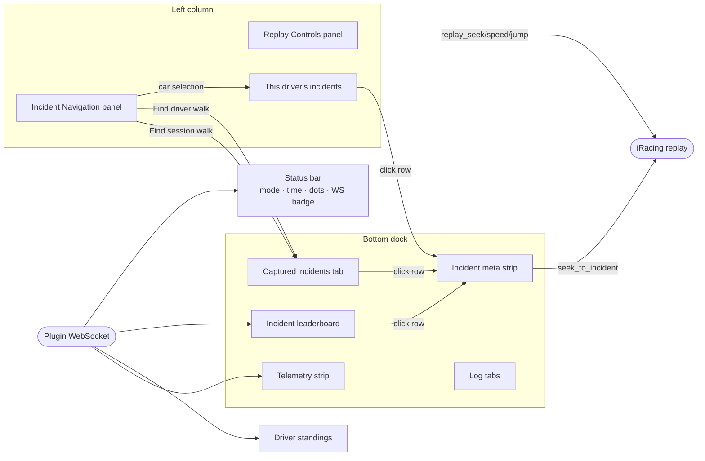
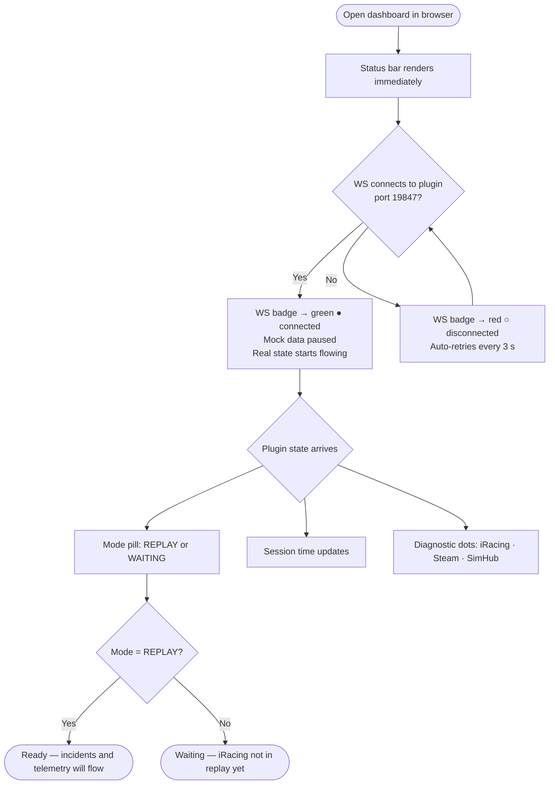
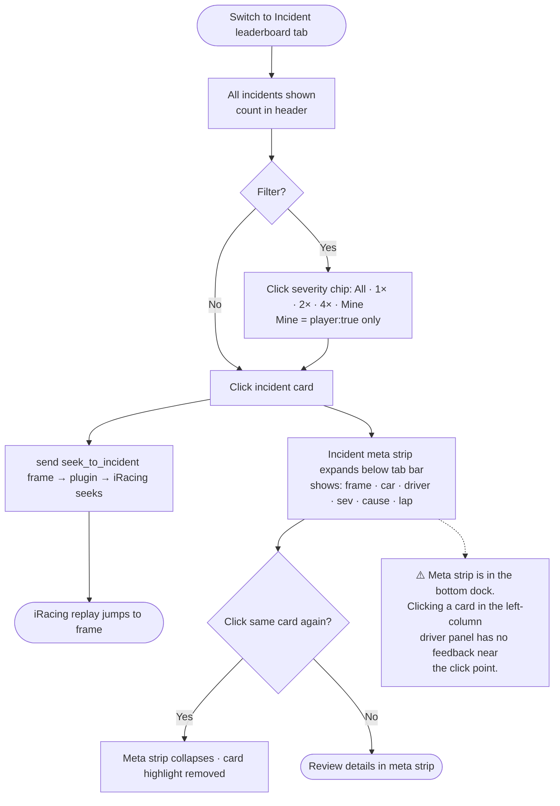
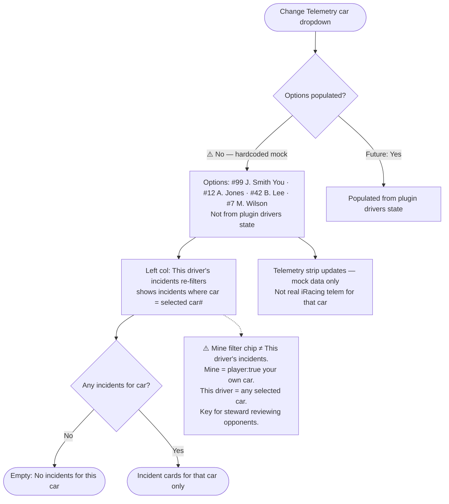
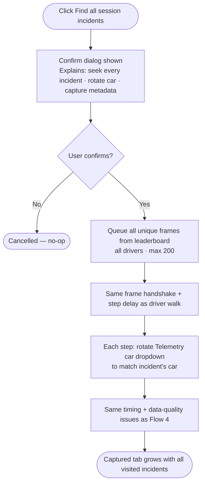
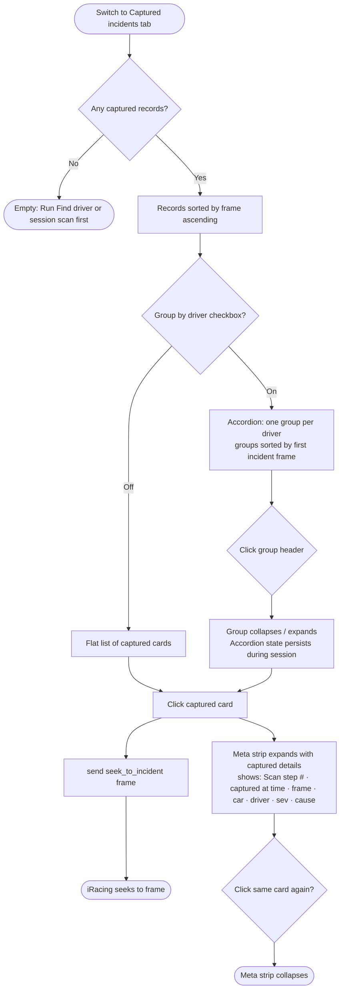
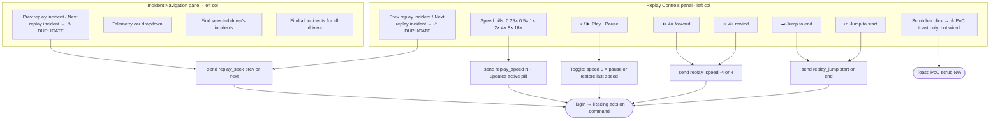

# Sim Steward — User Flows (today)

**What this is:** Step-by-step journeys through the actual shipped UI. Covers what happens when you click each thing, where flows work well, and where they break.

**Companion docs:**
- [PRODUCT-FLOW.md](PRODUCT-FLOW.md) — north-star vision, feature maturity table, what's missing
- [USER-FEATURES-PM.md](USER-FEATURES-PM.md) — PM-style feature descriptions and connections

---

## Overview

<details>
<summary>Overview diagram — how all flows connect</summary>



</details>

---

## Flow 1 — Check session health and connectivity

**Goal:** Confirm the dashboard is live, iRacing is in replay, and the plugin is connected before doing anything else.

<details>
<summary>Flow diagram</summary>



</details>

**What works:** Auto-reconnect is reliable (3 s loop). All three diagnostic dots and the WS badge give independent signals.

**Gap:** No toast or alert when WS reconnects after a drop — user must glance at the badge.

---

## Flow 2 — Review a specific incident

**Goal:** Jump to an incident frame and read its details.

<details>
<summary>Flow diagram</summary>



</details>

**Also works from:** [This driver's incidents](#flow-3--focus-on-one-driver) left panel and [Captured incidents](#flow-6--review-the-captured-incidents-tab) tab — same seek + meta strip behavior.

**Gap (issue 5):** Meta strip expands in the bottom dock. If you clicked from the left-column "This driver's incidents" panel, the expansion is far from your click and easy to miss.

---

## Flow 3 — Focus on one driver

**Goal:** Narrow everything to a single car's incidents and telemetry.

<details>
<summary>Flow diagram</summary>



</details>

**Gap (issue 2):** Car dropdown options are hardcoded (`#99 J. Smith (You)`, `#12 A. Jones`, etc.), not populated from the plugin's `drivers` state message. Works in PoC only.

**Important distinction:** "This driver's incidents" left panel is **not redundant** with the "Mine" chip. Mine shows only your own incidents (`player: true`). This panel shows the selected car — used by stewards to review opponent incidents.

---

## Flow 4 — Walk driver incidents (automated seek)

**Goal:** Automatically step through every incident for the selected car, logging a record of each.

<details>
<summary>Flow diagram</summary>

```mermaid
flowchart TD
  A([Select telemetry car]) --> B[Click Find driver's incidents]
  B --> C{Incidents for this car\nin leaderboard?}
  C -- No --> D([Toast: No incidents for this driver\nScan aborted])
  C -- Yes --> E[Queue unique frames for that car\nmax 200]
  E --> F["⚠️ Queue = already-known frames from leaderboard\n(not a YAML scan — no new discovery)"]
  F --> G[Button pulses red: Stop scan\nOther scan button disabled]
  G --> H[Loop: for each frame in queue]
  H --> I[send seek_to_incident frame → plugin → iRacing]
  I --> J[Wait until WS state frame ≈ target\n(waitForFrameApprox) or timeout]
  J --> K["Use matched plugin frame for record;\nif timeout fall back to DOM parse"]
  K --> L[Enrich record from incidents array\nsame data already in leaderboard]
  L --> M[Append to Captured incidents · render]
  M --> N[Update status: Driver N/total…]
  N --> O{More frames?}
  O -- Yes --> H
  O -- No  --> P[Scan ends · status: Done N found]
  B -- Stop clicked --> P
  P --> Q([Captured tab has visited records\n⚠️ Same data as leaderboard + reviewed-at timestamp])
```

</details>

**Gap (issue 3 + 4):** Automated walk still enriches from the same leaderboard metadata; frame sync uses plugin `state.frame` when possible. Full value for editors is still `capture_incident` + OBS.

**Issue 7 (labels):** Dashboard uses “Walk … listed incidents” plus tooltips stating this does not scan YAML for new incidents.

---

## Flow 5 — Walk all session incidents (automated seek)

**Goal:** Step through every incident for all drivers in the session.

<details>
<summary>Flow diagram</summary>



</details>

**Same issues as Flow 4.** The confirm dialog correctly sets expectations. Car rotation in the dropdown (`selectCarInDropdownForFrame`) is a nice touch — makes the walk visually track which car you're on.

---

## Flow 6 — Review the Captured incidents tab

**Goal:** Review everything the scan logged, optionally organized by driver.

<details>
<summary>Flow diagram</summary>



</details>

**Gap (issue 4):** Without OBS integration or `capture_incident`, Captured is a "reviewed" list of leaderboard incidents. The main added value is the `captured at` timestamp and the grouped accordion view for dense sessions.

---

## Flow 7 — Navigate with transport controls

**Goal:** Manually scrub, speed, and step through the replay.

<details>
<summary>Flow diagram</summary>



</details>

**Gap (issue 1):** "Prev replay incident" / "Next replay incident" appear in both the Replay Controls panel and the Incident Navigation panel. They call the same action (`replay_seek prev/next`, session-wide replay jump). One set is redundant — consolidate to one location.

**Gap:** Scrub bar click fires a toast (`[PoC] Scrub to N%`) and is not wired to an actual seek action.

---

## PM issues open

| # | Type | Issue |
|---|------|-------|
| 1 | UX debt | Duplicate prev/next replay incident buttons in two panels — consolidate |
| 2 | Missing feature | Telemetry car dropdown must be populated from plugin `drivers` state |
| 3 | Data quality | Capture walk uses `waitForFrameApprox` on plugin `state.frame`; timeout falls back to DOM parse |
| 4 | Value gap | Captured incidents = leaderboard subset + timestamp; value unclear until `capture_incident` exists |
| 5 | UX gap | Meta strip expands in bottom dock; no feedback near clicked card in left column |
| 6 | Product decision | "This driver's incidents" is NOT redundant with Mine chip — keep it (steward opponent review) |
| 7 | Clarity gap | "Find driver's incidents" label implies discovery; it walks already-known frames — consider renaming |

---

## ContextStream KB links

| Spec | Doc ID |
|------|--------|
| Sim Steward — Product Flow | `4f3c6370-0bfc-4f54-9848-9946745ac3d4` |
| Sim Steward — User Features (PM) | `c5157521-3681-4432-9c44-a49d8ee3a955` |
| Sim Steward — Architecture and Data Structures | `c453dd83-dfd9-4002-b8a2-2e0c8a4d032c` |
| Troubleshooting | `88274879-cd2d-4d86-9766-c86b88f95cfe` |
| Sim Steward — Data Routing (OTel / Loki / Prometheus) | `cbae1c33-c778-4e9a-9a8d-6b3e3c8c368b` |
