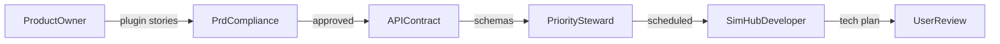

# Alpha: SimHub-First Stories to Tech Plan Pipeline

## Scope

**In scope (this repo):** SimHub plugin only – FR-A-001 through FR-A-006 (telemetry, buffer, detection, serialization, POST) and FR-A-012 through FR-A-015 (UI).

**Deferred (separate private repo):** Cloudflare Worker, R2, Workers AI, Steward prompt – FR-A-007 through FR-A-011.

The plugin implements the full send path (POST with CSV payload) against a **configurable endpoint URL**. Until the Worker repo exists, use a mock endpoint or stub. The plugin defines and consumes the **expected response schema** (per FR-A-011) so the UI can display rulings; mock JSON will be used until the Worker is live.

## Pipeline

### Step 1: Product-Owner writes stories

Delegate to `product-owner` to decompose plugin FR-IDs into atomic user stories:

- FR-A-001 through FR-A-006 (telemetry, buffer, detection, serialization, POST)
- FR-A-012 through FR-A-015 (main tab, overlay, grading, replay)
- Add explicit **Scaffold** story (SimHub plugin shell, iRacing SDK wiring, main loop, placeholder UI tab)
- Group closely related FRs (e.g., FR-A-001 + FR-A-002 = buffer story)
- Split FRs with multiple concerns (e.g., FR-A-003 auto vs manual detection)
- Write each story to `docs/product/stories/{FR-ID}-{slug}.md` using the template
- Include acceptance criteria, subtasks, dependency chains
- Flag PRD gaps as `[PROPOSED]` amendments

Expected output: ~8–12 story files.

### Step 2: API contract

Define request and response schemas in `docs/tech/api-design.md`:

- **Request:** CSV payload format, headers, `SessionTick`, `SessionNum` (FR-A-004, 005, 006)
- **Response:** JSON structure per FR-A-011 (Short Summary, Detailed Report, Ruling, Protest Statement)
- Endpoint path, method, headers

### Step 3: PRD-Compliance reviews stories

Delegate to `prd-compliance` to verify:

- Every plugin FR-ID (001–006, 012–015) is covered by at least one story
- No story drifts into Beta scope (FR-B-xxx)
- Acceptance criteria align with PRD requirement language
- Review `[PROPOSED]` amendments – accept (PRD update) or reject (product-owner revises)

### Step 4: Priority-Steward schedules stories

Delegate to `priority-steward` to:

- Add each approved story to `docs/product/priorities.md`
- Order by dependency chain: scaffold → buffer → detection → serialization → POST → UI
- Replace the high-level "Scaffold SimHub plugin" entry with granular story references

### Step 5: SimHub-Developer writes tech plan

Delegate to `simhub-developer` to write `docs/product/plans/tech-plugin.md` covering:

- Architecture decisions and component design
- Key code patterns / classes / interfaces
- File paths and project structure changes
- External dependencies (NuGet packages, SimHub SDK)
- Integration points (API contract, configurable endpoint)
- Verify `irsdk_BroadcastReplaySearch` availability for FR-A-015

### Step 6: User review

Present complete deliverables:

- Story files with acceptance criteria
- API contract in `docs/tech/api-design.md`
- Priority ordering in `docs/product/priorities.md`
- Tech plan in `docs/product/plans/tech-plugin.md`
- Any `[PROPOSED]` PRD amendments

User approves before implementation begins.

## Story Grouping (Plugin-Only)

| Phase | Stories | FR-IDs |
|-------|---------|--------|
| **0. Scaffold** | SimHub plugin shell | (new) |
| **1. Foundation** | Buffer + incident detection | FR-A-001, 002, 003 |
| **2. Data Pipeline** | Serialization + POST + API contract | FR-A-004, 005, 006 |
| **3. UI** | Main tab + grading (merged), overlay | FR-A-012, 014, 013 |
| **4. Replay** | Replay jumping (spike first) | FR-A-015 |

## Story Files (8 total)

- `docs/product/stories/SCAFFOLD-SimHub-Plugin.md`
- `docs/product/stories/FR-A-001-002-Telemetry-Buffer.md`
- `docs/product/stories/FR-A-003-Incident-Detection.md`
- `docs/product/stories/FR-A-004-005-Telemetry-Serialization.md`
- `docs/product/stories/FR-A-006-HTTPS-POST.md`
- `docs/product/stories/FR-A-012-014-Main-Tab-Incident-List.md` (FR-A-014 merged here)
- `docs/product/stories/FR-A-013-In-Game-Overlay.md`
- `docs/product/stories/FR-A-015-Replay-Jumping.md`

## Other Files

- `docs/tech/api-design.md` (request + response schemas)
- `docs/product/plans/tech-plugin.md` (simhub-developer tech plan)
- `docs/product/prd-compliance-report.md`
- Updated `docs/product/priorities.md`
