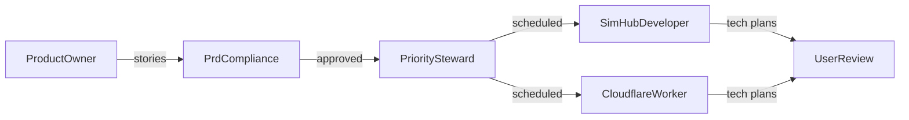

# Alpha: Stories to Tech Plans Pipeline

## Context

The PRD ([docs/product/prd.md](docs/product/prd.md)) defines 15 Alpha requirements across 4 domains. No user stories exist yet -- `docs/product/stories/` only has `_template.md`. The full agent chain is ready: product-owner, prd-compliance, priority-steward, simhub-developer, cloudflare-worker.

## Scope: All Alpha FR-IDs

**Telemetry Recorder (Client-Side):** FR-A-001 through FR-A-005
**Cloudflare Integration (Server-Side):** FR-A-006 through FR-A-009
**AI Steward Persona:** FR-A-010, FR-A-011
**User Interface (SimHub):** FR-A-012 through FR-A-015

## Pipeline

### Step 1: Product-Owner writes stories

Delegate to `product-owner` to decompose all 15 Alpha FR-IDs into atomic user stories:

- Group closely related FRs into single stories (e.g., FR-A-001 + FR-A-002 = buffer story)
- Split FRs with multiple concerns (e.g., FR-A-003 auto vs manual detection)
- Write each story to `docs/product/stories/{FR-ID}-{slug}.md` using the template
- Include acceptance criteria, subtasks, dependency chains
- Flag PRD gaps as `[PROPOSED]` amendments

Expected output: ~10-15 story files.

### Step 2: PRD-Compliance reviews stories

Delegate to `prd-compliance` to verify:

- Every Alpha FR-ID (FR-A-001 through FR-A-015) is covered by at least one story
- No story drifts into Beta scope (FR-B-xxx)
- Acceptance criteria align with PRD requirement language
- Report any gaps or coverage issues back for product-owner to fix

### Step 3: Priority-Steward schedules stories

Delegate to `priority-steward` to:

- Add each approved story to `docs/product/priorities.md`
- Order by dependency chain (buffer -> serialization -> POST -> Worker -> AI -> UI)
- Replace the high-level "Scaffold SimHub plugin" entry with granular story references

### Step 4: Domain agents write tech plans

Run in parallel:

- **simhub-developer**: Tech plans for plugin-side stories (telemetry buffer, incident detection, CSV serialization, HTTPS POST, main tab UI, overlay, replay jumping, visual grading)
- **cloudflare-worker**: Tech plans for backend stories (Worker endpoint, R2 archival, Workers AI integration, Steward prompt + JSON output)

Each tech plan should include:

- Architecture decisions and component design
- Key code patterns / classes / interfaces
- File paths and project structure changes
- External dependencies (NuGet packages, Cloudflare bindings)
- Integration points between client and server

### Step 5: User review

Present complete deliverables:

- Story files with acceptance criteria
- Priority ordering
- Tech plans per domain
- Any `[PROPOSED]` PRD amendments

User approves before implementation begins.

## Story Grouping (Proposed)

Based on dependency analysis, stories will cluster into implementation phases:

1. **Foundation** -- Buffer + incident detection (FR-A-001, 002, 003)
2. **Data Pipeline** -- Serialization + POST (FR-A-004, 005, 006)
3. **Backend Core** -- R2 archival + AI processing (FR-A-007, 008, 009)
4. **AI Logic** -- Steward prompt + output format (FR-A-010, 011)
5. **UI Shell** -- Main tab + overlay (FR-A-012, 013)
6. **UI Polish** -- Grading + replay (FR-A-014, 015)

Product-owner will finalize groupings based on atomicity and session-size constraints.

## Files Created

- `docs/product/stories/FR-A-*-*.md` (one per story, ~10-15 files)
- Tech plan files (location TBD by domain agents, likely in `docs/product/` or as Cursor plan files)
- Updated `docs/product/priorities.md`

