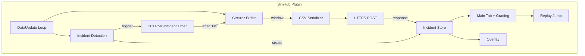
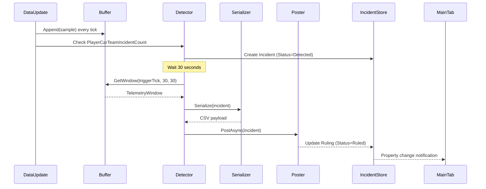

# Sim Steward Plugin: Technical Plan

SimHub plugin technical design for Alpha (SimHub-first). Implements FR-A-001 through FR-A-006, FR-A-012 through FR-A-015.

## Architecture Overview



## Key Design Change: Post-Incident Orchestration

The original plan had Detection triggering Serialization immediately. This would capture 30s pre-incident but 0s post-incident data.

**Corrected flow:**
1. Detection fires (auto or manual) -> creates `Incident` in Store with Status=`Detected`
2. Detection starts a 30-second async timer
3. Buffer keeps filling during the 30s wait
4. Timer fires -> Detection calls `Buffer.GetWindow(triggerTick, 30, 30)` -> populates `Incident.TelemetryWindow`
5. Serializer receives the complete 60s window -> writes CSV -> stores on `Incident.SerializedPayload`
6. POST fires -> sends CSV -> parses response -> stores `Incident.Ruling`

## Project Structure

```
plugin/
├── SimStewardPlugin/
│   ├── SimStewardPlugin.cs          # IPlugin, DataUpdate, SimHub entry
│   ├── Models/
│   │   ├── Incident.cs              # Incident data model (defined in FR-A-003 story)
│   │   ├── TelemetrySample.cs       # Single buffer row
│   │   └── StewardResponse.cs       # Parsed API response
│   ├── TelemetryBuffer.cs           # Circular buffer (FR-A-001, 002)
│   ├── IncidentDetector.cs          # Auto + manual triggers + 30s timer (FR-A-003)
│   ├── IncidentStore.cs             # Session incidents list + SimHub properties
│   ├── CsvSerializer.cs             # Token Diet serialization (FR-A-004, 005)
│   ├── TelemetryPoster.cs           # HTTPS POST, retry, mock mode (FR-A-006)
│   ├── BroadcastHelper.cs           # irsdk_broadcastMsg replay jump (FR-A-015)
│   ├── Properties/
│   │   └── AssemblyInfo.cs
│   └── assets/
│       ├── MainTab.html             # Main tab + grading UI (FR-A-012, 014)
│       └── Overlay.html             # In-game overlay (FR-A-013)
├── SimStewardPlugin.csproj
└── README.md
```

## Components

### 1. TelemetryBuffer (FR-A-001, FR-A-002)

**Purpose:** Always-on circular ring buffer of telemetry samples in RAM.

**Design:**
- Ring buffer with fixed capacity: 90s at ~20 Hz = 1800 samples (headroom beyond 60s window)
- Each sample: `TelemetrySample { Time, Speed, BrakePct, SteerPct, Gap, Overlap, SessionTick, SessionNum }`
- API: `Append(sample)` -- O(1), called from `DataUpdate` every tick
- API: `GetWindow(centerTick, preSeconds, postSeconds)` -- returns `List<TelemetrySample>`
- **The buffer does not know about incidents.** It is always-on. Detection decides when to snapshot.

**iRacing SDK var mapping (to be finalized during implementation):**
- `Speed` -> `irsdk_Speed` or SimHub `GameRawData.Telemetry.Speed`
- `BrakePct` -> `irsdk_Brake` (0.0-1.0, scale to 0-100)
- `SteerPct` -> `irsdk_SteeringWheelAngle` (radians, normalize to -100..100)
- `Gap` -> may require computation from `irsdk_CarIdxLapDistPct` array (spike if complex)
- `Overlap` -> may require computation from car position arrays (spike if complex)

### 2. IncidentDetector (FR-A-003)

**Purpose:** Detect incidents, own the 30s post-incident delay, create Incident objects.

**Design:**
- Subscribe to `DataUpdate`; track previous `PlayerCarTeamIncidentCount`
- On increase: compute severity delta (0x, 1x, 2x, 4x), fire detection
- Register SimHub action "SimSteward.MarkIncident" for manual trigger
- On trigger: create `Incident` object (see model in FR-A-003 story), add to `IncidentStore`
- Start 30s async timer (non-blocking). When timer fires:
  - Call `TelemetryBuffer.GetWindow(incident.SessionTick, 30, 30)`
  - Populate `Incident.TelemetryWindow`
  - Advance Status to `WaitingForPost`
  - Hand off to CsvSerializer
- Debounce rapid triggers within 500ms window
- Handle overlapping incidents independently (each gets its own timer)

### 3. IncidentStore

**Purpose:** Session-scoped in-memory incident list. Central data source for all UI.

**Design:**
- `List<Incident>` with add/update operations
- Resets on new iRacing session
- Exposes SimHub properties:
  - `SimSteward.IncidentCount` (int)
  - `SimSteward.LastIncidentSummary` (string)
  - `SimSteward.LastIncidentVerdict` (string)
  - `SimSteward.Incidents` (serialized list for UI binding)
- Thread-safe: Detection writes, UI reads, POST updates

### 4. CsvSerializer (FR-A-004, FR-A-005)

**Purpose:** Pure function: Incident in, CSV string out.

**Design:**
- Input: `Incident` with populated `TelemetryWindow`
- Output: CSV string per `docs/tech/api-design.md`
- Writes metadata rows (SessionNum, SessionTick, IncidentTime), header row, data rows
- Stores result on `Incident.SerializedPayload`
- Numeric precision: 1 decimal for speed, 0 for percentages
- No timers, no triggers, no network

### 5. TelemetryPoster (FR-A-006)

**Purpose:** POST CSV to configurable endpoint; parse JSON response; retry on failure.

**Design:**
- Static `HttpClient` with configurable timeout (default 30s)
- Endpoint URL from plugin settings (`WorkerEndpointUrl`)
- Headers: `Content-Type: text/csv; charset=utf-8`
- Parse response into `StewardResponse` per API contract response schema
- Store on `Incident.Ruling`; advance Status to `Ruled`
- **Mock mode:** URL empty or "mock" -> return hardcoded `StewardResponse`
- **Retry:** On transient failure (network, 5xx), retry once after 5s. On second failure, Status=Error
- **Cancellation:** `CancellationToken` for plugin shutdown / session end
- Fully async; does not block `DataUpdate`

### 6. Main Tab + Visual Grading (FR-A-012, FR-A-014)

**Purpose:** Desktop UI with incident list, color-coded grading, report view, copy-to-clipboard.

**Design:**
- SimHub plugin tab with HTML content per `simhub-dashboard.mdc`
- Incident list with grade icons: Red (#E53935), Yellow (#FDD835), Skull (#424242), Grey (pending)
- Verdict-to-icon mapping: `OpponentAtFault`->Red, `RacingIncident`->Yellow, `PlayerAtFault`->Skull
- Detail pane: shortSummary, detailedReport, ruling, protestStatement (HTML rendered)
- "Copy to Clipboard" button for protest statement
- States: empty ("No incidents"), pending ("Analyzing..."), error (message + retry), ruled (full report)
- Property prefix: `SimSteward.*`

### 7. In-Game Overlay (FR-A-013)

**Purpose:** Transparent HUD with status, last 3 incidents, Mark indicator.

**Design:**
- SimHub overlay or Dash Studio screen
- Status: Connected/Buffering/Ready/Error
- Last 3 incidents with grade icons (reuses verdict mapping from Main Tab)
- Mark indicator: "Press [X] to mark" (informational; actual trigger is SimHub action)
- Show/hide toggle: "SimSteward.ToggleOverlay" action
- Minimal layout; high contrast; non-intrusive

### 8. Replay Jumping (FR-A-015)

**Purpose:** "Review" button jumps iRacing replay to IncidentTime - 30s.

**Design:**
- **Spike first:** Verify `irsdk_broadcastMsg` / `irsdk_BroadcastReplaySearchSessionTime` is accessible from SimHub/iRacingSdkWrapper
- `BroadcastHelper.JumpToReplay(sessionNum, sessionTick)` using verified API
- Target: `Incident.SessionTick - 30s` (convert to replay frame/time as needed)
- Review button in main tab list items and detail view
- Graceful degradation: "Enter replay mode first" message if not in replay
- **Fallback:** If API not accessible, show "Go to replay at [time]" for manual navigation

## Dependencies

| Package | Purpose |
|---------|---------|
| SimHub.Plugins | Plugin SDK |
| iRacingSdkWrapper | iRacing telemetry (or SimHub's built-in iRacing support) |
| Newtonsoft.Json | JSON parsing for API response |
| .NET Framework 4.8 | Per PRD |

## Data Flow



## Risks and Mitigations

| Risk | Mitigation |
|------|-------------|
| `irsdk_broadcastMsg` not exposed in SimHub | Spike first in FR-A-015; document fallback |
| Gap/Overlap columns require complex computation | Flag as spike in Buffer story; simplify or drop columns if needed |
| Buffer memory at high sample rate | Cap at ~20 Hz; 1800 samples * ~48 bytes = ~86 KB (trivial) |
| POST blocks main loop | Fully async with CancellationToken |
| Overlapping incidents during 30s wait | Each incident gets independent timer; IncidentStore handles concurrent adds |
| SimHub overlay format unknown | Reference simhub-dashboard.mdc; prototype early |

## Implementation Order

Follow `docs/product/priorities.md`:

1. SCAFFOLD -- project, IPlugin, DataUpdate, placeholder tab
2. FR-A-001-002 -- TelemetryBuffer (ring buffer, GetWindow)
3. FR-A-003 -- IncidentDetector (detection, 30s timer, Incident model, IncidentStore)
4. FR-A-004-005 -- CsvSerializer (pure function)
5. FR-A-006 -- TelemetryPoster (POST, retry, mock mode)
6. FR-A-012-014 -- Main Tab + Visual Grading (merged)
7. FR-A-013 -- Overlay
8. FR-A-015 -- Replay Jumping (spike first)
