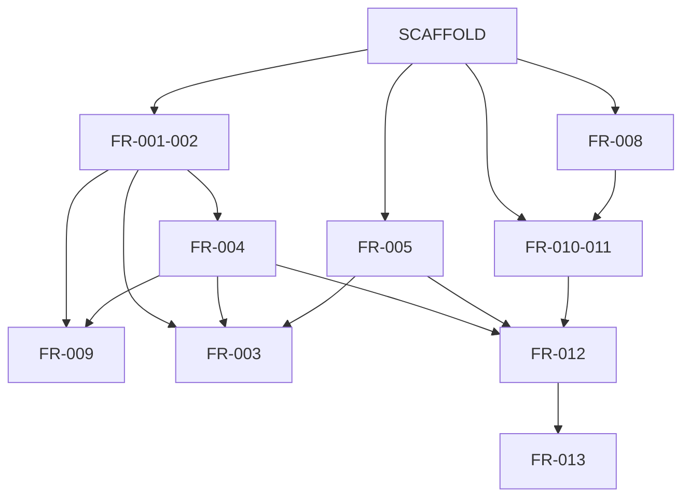

# Sim Steward -- Product Requirements Document

> **Version:** 3.0  
> **Date:** 2026-02-13  
> **Status:** Draft  
> **Detail:** Per-FR specs in `docs/product/specs/`. Tech plans in `docs/tech/plans/`.

---

## 1. Executive Summary

Sim Steward is a SimHub plugin that turns iRacing incident clipping from a 15-minute chore into a one-click action. It detects incidents, jumps to replay, records clips via OBS, and (in Part 2) automates multi-camera angles — producing protest-ready video in seconds.

---

## 2. Problem Statement

Filing an iRacing protest requires manually scrubbing replay to find the incident, setting up screen recording, capturing the clip, editing it, and uploading. This takes **5-15 minutes per incident**. Most drivers don't bother. Bad actors go unreported. Sim racing stays dirty.

**Sim Steward fixes this:** incident happens → you clip it → you file. Seconds, not minutes.

---

## 3. User Personas

| Persona | Goal | Pain Point |
|---------|------|------------|
| **The Protester** | Report bad driving (intentional wrecking, unsafe rejoins) | The 15-20 min manual process kills motivation to protest |
| **The Clean Racer** | Make sim racing cleaner through accountability | Knows bad behavior goes unreported because protesting is too hard |

---

## 4. Part 1 Requirements — Detect + Clip + Save (MVP)

Core loop: **Detect (while racing) → Review in Replay → Jump → Record → Save**

| ID | Requirement | Description | Priority | Key behaviors & edge cases |
|----|-------------|-------------|----------|----------------------------|
| FR-001 | Auto Incident Detection | Detect iRacing incidents via `PlayerCarTeamIncidentCount` delta. Fire event with session timestamp on change. | Must | Delta > 0 triggers; merge/debounce within 5s; clear list on SessionNum change or disconnect; works at 10Hz or 60Hz DataUpdate. Spec: [FR-001-002-Incident-Detection](specs/FR-001-002-Incident-Detection.md). |
| FR-002 | Manual Incident Mark | Hotkey to manually mark "incident happened now" with current session timestamp. | Must | SimHub `AddAction("SimSteward.MarkIncident")`; records same IncidentRecord model as auto. Spec: same as FR-001. |
| FR-003 | Replay Mode Overlay | In replay mode: overlay shows incidents, jump controls, OBS record, connection status. Live racing: minimal toast only. | Must | Visibility bound to IsReplayMode; 8-slot incident list; clip save/discard prompt (R-OVR-09). Specs: [FR-003a-Replay-Overlay](specs/FR-003a-Replay-Overlay.md), [FR-003b-Live-Toast](specs/FR-003b-Live-Toast.md). Tech: [dash-studio-overlay](../tech/plans/dash-studio-overlay.md). |
| FR-004 | Replay Jump | Send iRacing to replay at incident timestamp using `irsdk_BroadcastReplaySearchSessionTime`. Offset before incident. | Must | JumpToReplay(sessionNum, sessionTime, offsetSeconds); target = (time - offset)*1000 ms, clamp ≥ 0; fallback message if broadcast fails. Spec: [FR-004-Replay-Control](specs/FR-004-Replay-Control.md). |
| FR-005 | OBS Connection | Connect to OBS via WebSocket (obs-websocket 5.x). Handle connect/disconnect/reconnect. Surface status in UI. | Must | State machine: Disconnected/Connecting/Connected/Reconnecting/Error; exponential backoff; properties SimSteward.OBS.StatusText, IsConnected. Spec: [FR-005-OBS-Connection](specs/FR-005-OBS-Connection.md). Tech: [obs-websocket-spike](../tech/plans/obs-websocket-spike.md). |
| FR-006 | Start/Stop Recording | Start OBS recording on user action. Stop on user action. OBS saves file per its own settings. | Must | ToggleRecording action; state Idle→Recording→Stopping→Idle; sync GetRecordStatus on connect; handle OBS disconnect mid-recording. Spec: [FR-006-007-Recording-Clips](specs/FR-006-007-Recording-Clips.md). |
| FR-007 | Clip Save Prompt | After recording stops, show clip path in overlay/UI. Confirm save or discard. | Should | LastClipPath, LastClipStatus; Save = confirm keep; Discard = delete with confirmation; handle file locked/not found. Spec: same as FR-006. |
| FR-008 | Plugin Settings Tab | SimHub settings: OBS URL/password, hotkeys, auto-detect, replay offset, toast duration. | Must | Persist via SimHub APIs; immediate effect; OBS test button; ToastDurationSeconds 2–8s. Spec: [FR-008-Plugin-Settings](specs/FR-008-Plugin-Settings.md). |
| FR-009 | Incident Log | In-session list of incidents with timestamps. User can select any to jump to replay. | Should | WPF list in settings tab; newest-first; Jump to Replay per row; clear on session change. Spec: [FR-009-Incident-Log](specs/FR-009-Incident-Log.md). |

**Foundation (no FR-ID):** Plugin shell, telemetry read, placeholder settings. Spec: [SCAFFOLD-Plugin-Foundation](specs/SCAFFOLD-Plugin-Foundation.md). Tech: [scaffold-plugin-setup](../tech/plans/scaffold-plugin-setup.md).

---

## 5. Part 2 Requirements — Automated Multi-Camera Clipping

Builds on Part 1. Camera control and automated replay loops.

| ID | Requirement | Description | Priority | Key behaviors & edge cases |
|----|-------------|-------------|----------|----------------------------|
| FR-010 | Camera Selection | User configures which camera angles to use. Settings tab checklist. | Must | Enumerate from session info (spike); select 1–4; persist; fallback if selected camera not in session. Spec: [FR-010-011-Camera-Control](specs/FR-010-011-Camera-Control.md). Tech: [camera-enumeration-spike](../tech/plans/camera-enumeration-spike.md). |
| FR-011 | Camera Switching | Switch iRacing replay camera via `irsdk_broadcastMsg` `CamSwitchNum`. | Must | SwitchCamera(cameraGroupId); player car index from telemetry; works during replay. Spec: same as FR-010. |
| FR-012 | Automated Replay Loop | One-click multi-camera recording: jump → camera 1 → record → rewind → camera 2 → record... | Must | Record All Angles trigger; loop per camera with delays; cancel keeps completed clips; one angle fails → continue rest. Spec: [FR-012-Recording-Orchestrator](specs/FR-012-Recording-Orchestrator.md). Tech: [recording-orchestrator-timing](../tech/plans/recording-orchestrator-timing.md). |
| FR-013 | Single Output File | Combine camera angles into one sequential video (angle 1 then angle 2). | Must | Async stitch (e.g. FFmpeg concat); notify on complete; failure preserves individual clips. Spec: [FR-013-Video-Stitching](specs/FR-013-Video-Stitching.md). Tech: [video-stitching-spike](../tech/plans/video-stitching-spike.md). |
| FR-014 | Clip Duration Control | User sets clip duration (seconds before/after incident). | Should | Settings: before (default 5), after (default 10); orchestrator uses for replay start and record length. Spec: [FR-014-015-Clip-Duration-Progress](specs/FR-014-015-Clip-Duration-Progress.md). |
| FR-015 | Recording Progress Indicator | Overlay shows which angle is recording (e.g. "Recording angle 1 of 2..."). | Should | SimSteward.MultiCam.* properties (IsActive, CurrentAngleIndex, TotalAngles, ProgressText). Spec: same as FR-014. |

---

## 6. Dependency Graph



---

## 7. Data Model Summary

| Model | Key fields | Used by |
|-------|------------|---------|
| **IncidentRecord** | Id, SessionTime, SessionNum, Delta, Source (Auto/Manual), DetectedAt | FR-001/002, FR-003a/b, FR-004, FR-009 |
| **Settings (Part 1)** | ObsWebSocketUrl, ObsWebSocketPassword, AutoDetectIncidents, ReplayOffsetSeconds, ToastDurationSeconds | FR-005, FR-001, FR-004, FR-003b, FR-008 |
| **Settings (Part 2)** | SelectedCameraIds, ClipBeforeSeconds, ClipAfterSeconds | FR-010, FR-012, FR-014 |
| **OBS connection state** | Disconnected / Connecting / Connected / Reconnecting / Error | FR-005, FR-003a |
| **RecordingState** | Idle / Recording / Stopping | FR-006, FR-003a |
| **ClipRecord** | OutputPath, CreatedAt, Status (Pending/Saved/Discarded) | FR-007, FR-003a |

---

## 8. Spec Index

| FR-ID | Spec | Tech plan(s) |
|-------|------|--------------|
| — | [SCAFFOLD-Plugin-Foundation](specs/SCAFFOLD-Plugin-Foundation.md) | [scaffold-plugin-setup](../tech/plans/scaffold-plugin-setup.md) |
| FR-001, FR-002 | [FR-001-002-Incident-Detection](specs/FR-001-002-Incident-Detection.md) | — |
| FR-003 | [FR-003a-Replay-Overlay](specs/FR-003a-Replay-Overlay.md), [FR-003b-Live-Toast](specs/FR-003b-Live-Toast.md) | [dash-studio-overlay](../tech/plans/dash-studio-overlay.md) |
| FR-004 | [FR-004-Replay-Control](specs/FR-004-Replay-Control.md) | — |
| FR-005 | [FR-005-OBS-Connection](specs/FR-005-OBS-Connection.md) | [obs-websocket-spike](../tech/plans/obs-websocket-spike.md) |
| FR-006, FR-007 | [FR-006-007-Recording-Clips](specs/FR-006-007-Recording-Clips.md) | — |
| FR-008 | [FR-008-Plugin-Settings](specs/FR-008-Plugin-Settings.md) | — |
| FR-009 | [FR-009-Incident-Log](specs/FR-009-Incident-Log.md) | — |
| FR-010, FR-011 | [FR-010-011-Camera-Control](specs/FR-010-011-Camera-Control.md) | [camera-enumeration-spike](../tech/plans/camera-enumeration-spike.md) |
| FR-012 | [FR-012-Recording-Orchestrator](specs/FR-012-Recording-Orchestrator.md) | [recording-orchestrator-timing](../tech/plans/recording-orchestrator-timing.md) |
| FR-013 | [FR-013-Video-Stitching](specs/FR-013-Video-Stitching.md) | [video-stitching-spike](../tech/plans/video-stitching-spike.md) |
| FR-014, FR-015 | [FR-014-015-Clip-Duration-Progress](specs/FR-014-015-Clip-Duration-Progress.md) | — |

---

## 9. Spike Summary

| # | Risk | Blocks | Tech plan | Status |
|---|------|--------|-----------|--------|
| 1 | OBS WebSocket from .NET 4.8 | FR-005, FR-006 | [obs-websocket-spike](../tech/plans/obs-websocket-spike.md) | Pending |
| 2 | Video stitching (one file from N clips) | FR-013 | [video-stitching-spike](../tech/plans/video-stitching-spike.md) | Pending |
| 3 | iRacing camera enumeration | FR-010, FR-011 | [camera-enumeration-spike](../tech/plans/camera-enumeration-spike.md) | Pending |

---

## 10. Technical Architecture

```
┌──────────────────────────────────────────────┐
│                  SimHub Host                  │
│  ┌──────────────────────────────────────┐    │
│  │        Sim Steward Plugin (C#)       │    │
│  │  Incident Detector │ Replay Control  │    │
│  │  OBS WebSocket Client                │    │
│  │  Overlay / Settings UI               │    │
│  └──────────────────────────────────────┘    │
└──────────────────────────────────────────────┘
         │                      │
         ▼                      ▼
   ┌───────────┐         ┌───────────┐
   │  iRacing   │         │    OBS    │
   │  (irsdk)   │         │ (ws 5.x)  │
   └───────────┘         └───────────┘
```

| Component | Technology | Notes |
|-----------|-----------|-------|
| Plugin runtime | C# / .NET Framework 4.8 | SimHub plugin contract |
| iRacing | iRSDKSharp.dll (bundled) | Telemetry + replay broadcast + CamSwitchNum (Part 2) |
| OBS | obs-websocket 5.x | WebSocket in plugin; OBS must be running |
| Video stitching | TBD per spike (FFmpeg concat preferred) | See Section 9 |
| UI | Dash Studio (overlay) + WPF (settings) | |

**No backend.** Everything runs locally.

---

## 11. Constraints & Risks

| # | Item | Type | Impact | Mitigation |
|---|------|------|--------|------------|
| 1 | OBS WebSocket from SimHub (.NET 4.8) | Spike | Blocks FR-005, FR-006 | [obs-websocket-spike](../tech/plans/obs-websocket-spike.md); fallback: out-of-process bridge |
| 2 | Video stitching | Spike | Blocks FR-013 | [video-stitching-spike](../tech/plans/video-stitching-spike.md); option C: ship separate files first |
| 3 | iRacing camera enumeration | Spike | Blocks FR-010, FR-011 | [camera-enumeration-spike](../tech/plans/camera-enumeration-spike.md) |
| 4 | Replay timing accuracy | Unknown | Clip quality | Configurable offset (FR-008); test in implementation |
| 5 | OBS must be running | Dependency | UX | Connection status (FR-005), clear messaging |
| 6 | SimHub overlay API | Low | UI limits | Dash Studio + WPF fallback |

---

## 12. Future — AI Analysis

Once Sim Steward has real users and a validated clipping workflow, a future phase may explore AI-powered analysis (e.g. fault determination, protest text). **Out of scope** for this PRD; scoped separately after user feedback.

---

## Appendix: Glossary

| Term | Definition |
|------|-----------|
| irsdk | iRacing SDK — C API (iRSDKSharp in .NET) for telemetry and broadcast commands |
| obs-websocket | OBS plugin (built-in since OBS 28) — WebSocket server for remote control |
| Session timestamp | iRacing `SessionTime` (seconds from session start) |
| CamSwitchNum | iRacing broadcast to change replay camera (group/number) |
| Dash Studio | SimHub overlay/dashboard editor |
