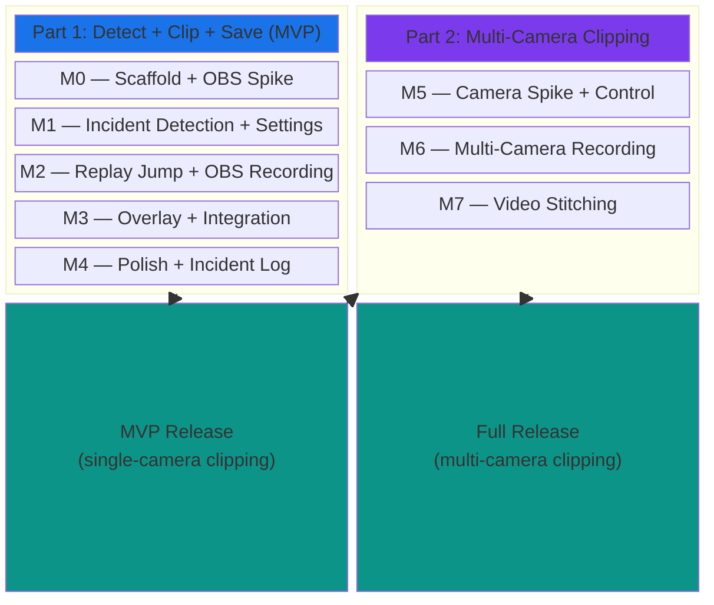
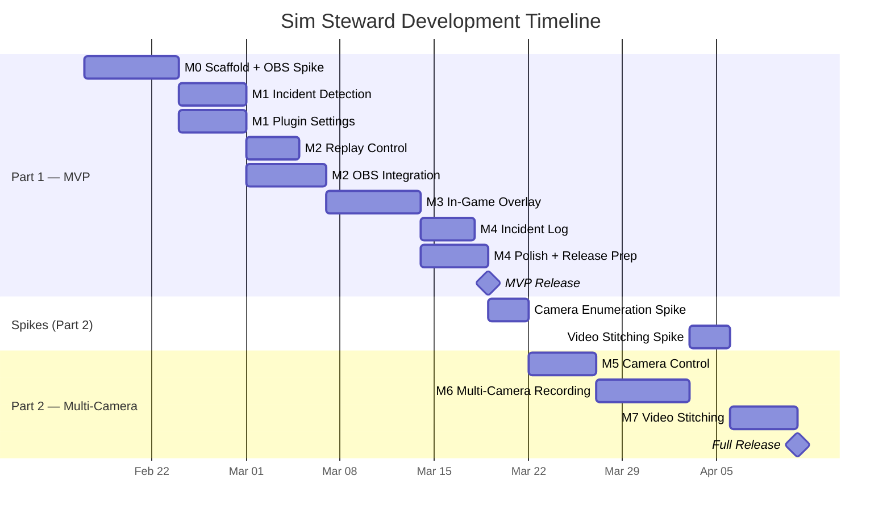
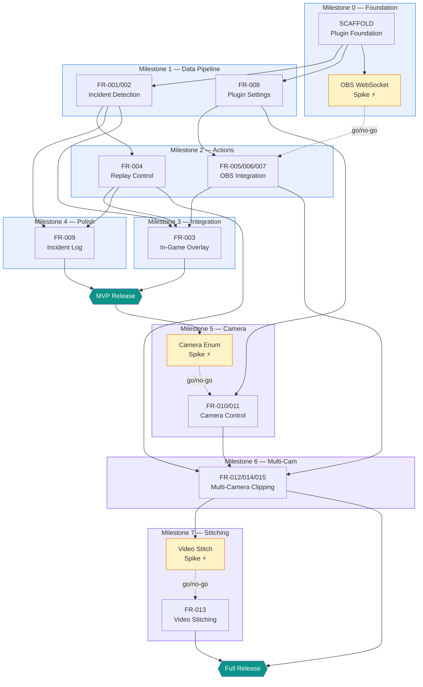
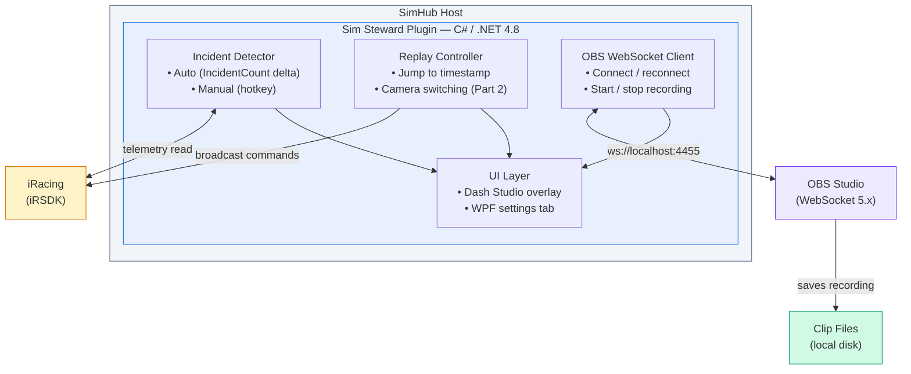
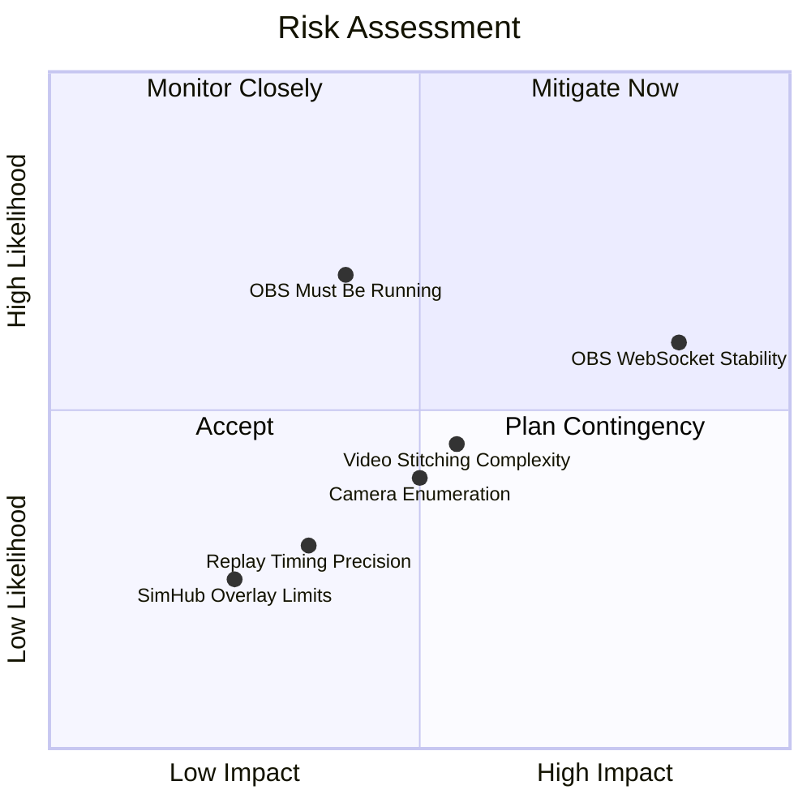
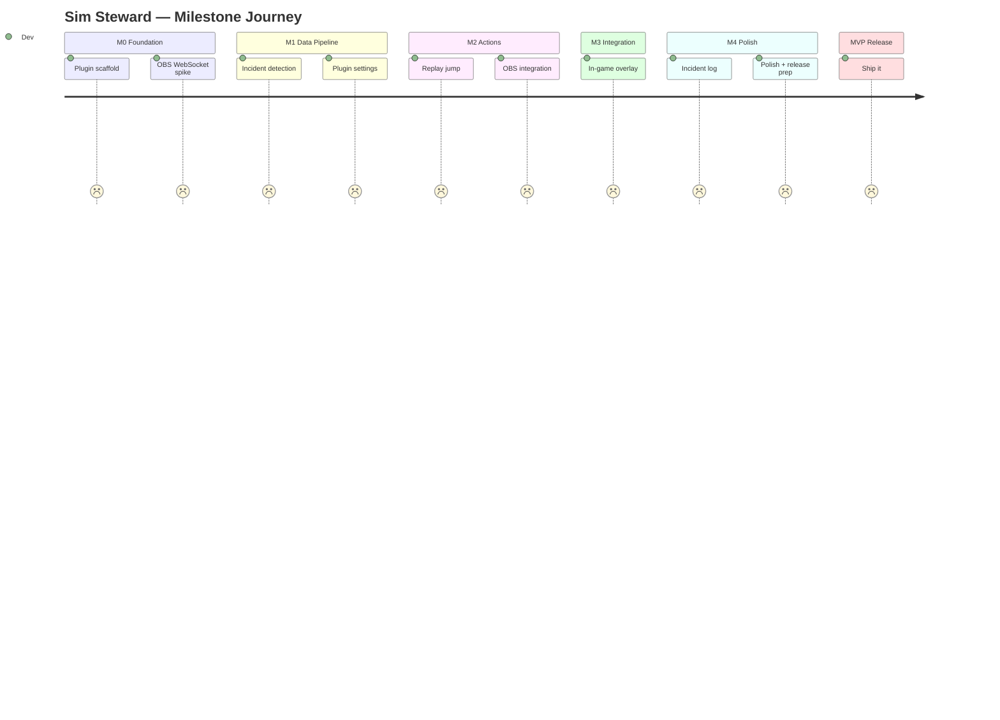
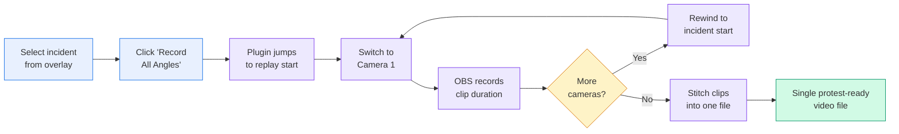
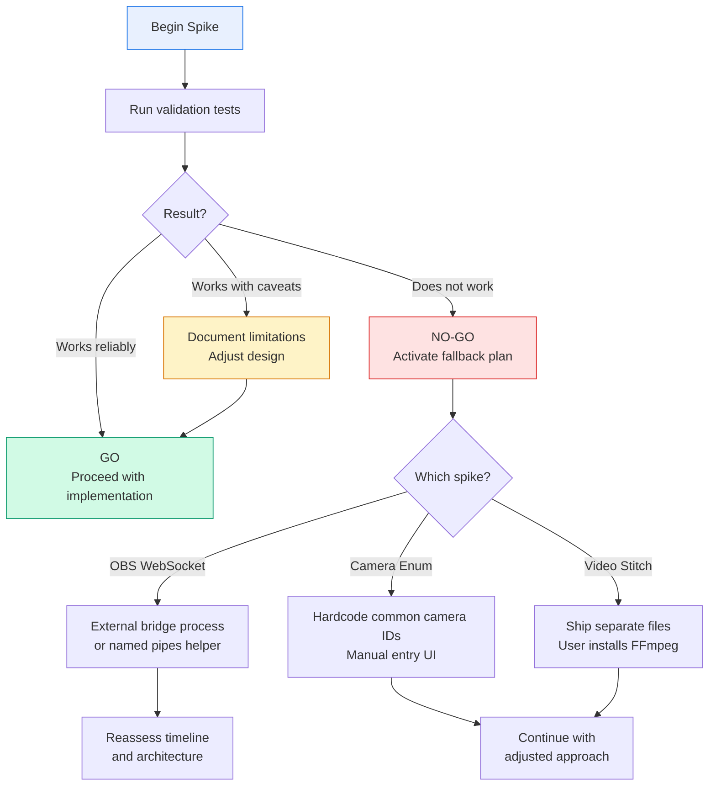
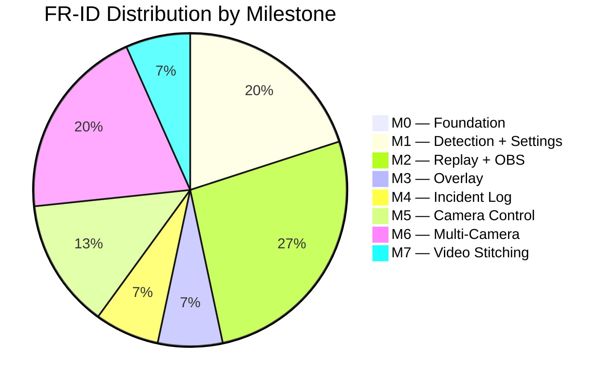

# Sim Steward Roadmap

> **Version:** 1.1  
> **Date:** 2026-02-13  
> **Status:** Draft  
> **Source of truth for priorities:** `docs/product/priorities.md`

---

## Overview

Two-part roadmap with a risk-first sequencing philosophy. Spikes run early to validate architecture before committing to implementation. Each milestone ends with a testable, working vertical slice.

---

## Gantt Chart

> **Note:** Durations are rough estimates for sequencing purposes. Actual pace depends on spike outcomes, testing needs, and iteration. The key insight is the shape of the dependency graph, not the specific dates.

---

## Dependency Graph

---

## Architecture

---

## Core User Flow

```mermaid
flowchart LR
  A["Race in\niRacing"] --> B{"Incident\noccurs"}
  B -->|auto-detect| C["Plugin captures\ntimestamp"]
  B -->|manual hotkey| C
  C --> D["Toast notification\n'4x at 12:34'"]
  D --> E["Enter replay\nmode"]
  E --> F["Overlay appears\nwith incident list"]
  F --> G["Select incident\n& click Jump"]
  G --> H["Replay jumps to\nincident - offset"]
  H --> I["Click Start\nRecording"]
  I --> J["OBS records\nthe clip"]
  J --> K["Click Stop\nRecording"]
  K --> L["Save or\ndiscard clip"]
  L --> M["Protest-ready\nvideo file"]

  style A fill:#f1f5f9,stroke:#64748b
  style B fill:#fef3c7,stroke:#d97706
  style C fill:#e8f0fe,stroke:#1a73e8
  style D fill:#e8f0fe,stroke:#1a73e8
  style E fill:#f1f5f9,stroke:#64748b
  style F fill:#e8f0fe,stroke:#1a73e8
  style G fill:#e8f0fe,stroke:#1a73e8
  style H fill:#ede9fe,stroke:#7c3aed
  style I fill:#ede9fe,stroke:#7c3aed
  style J fill:#ede9fe,stroke:#7c3aed
  style K fill:#ede9fe,stroke:#7c3aed
  style L fill:#e8f0fe,stroke:#1a73e8
  style M fill:#d1fae5,stroke:#059669
```

---

## Risk Matrix

---

## Milestone Progress Tracker

> Update scores (1-5) as milestones progress: 1 = not started, 3 = in progress, 5 = complete.

---

## Part 1 -- MVP (Detect + Clip + Save)

### Milestone 0: Foundation + OBS Spike

**Goal:** Plugin loads in SimHub, reads iRacing telemetry, and we know OBS WebSocket works from .NET 4.8.

| Story | FR-IDs | Type | Risk |
|-------|--------|------|------|
| SCAFFOLD-Plugin-Foundation | -- | Implementation | Low |
| OBS WebSocket spike | FR-005 (partial) | Spike | **High** -- biggest architectural risk |

**SCAFFOLD delivers:**
- C# class library targeting .NET 4.8, compiles cleanly
- `IPlugin` + `IDataPlugin` interfaces implemented
- Loads in SimHub, appears in plugin list
- Reads `SessionTime`, `PlayerCarTeamIncidentCount`, `SessionNum` from iRacing
- Detects iRacing connection/disconnection
- Placeholder settings tab (WPF UserControl)
- Debug logging to SimHub log

**OBS spike validates:**
- Can a .NET 4.8 SimHub plugin open and maintain a WebSocket connection to OBS?
- Can it complete the obs-websocket 5.x auth handshake?
- Can it send `StartRecord` / `StopRecord` and get responses?
- Library choice: `websocket-sharp`, raw `System.Net.WebSockets`, or other?

**Exit criteria:** Plugin logs iRacing telemetry in SimHub. OBS spike has a clear go/no-go answer. If no-go, escalate to reassess architecture before proceeding.

**Why this order:** The OBS spike is front-loaded because it's the single gate that could invalidate the entire recording approach. We run it in parallel with the scaffold so we don't waste time building on a foundation that might need rethinking.

---

### Milestone 1: Incident Detection + Settings

**Goal:** Plugin detects incidents and has a real settings UI. The core data pipeline is working.

| Story | FR-IDs | Type | Depends On |
|-------|--------|------|------------|
| FR-001-002 Incident Detection | FR-001, FR-002 | Implementation | M0 (SCAFFOLD) |
| FR-008 Plugin Settings | FR-008 | Implementation | M0 (SCAFFOLD) |

**Incident Detection delivers:**
- Auto-detection via `PlayerCarTeamIncidentCount` delta
- Manual hotkey mark (via SimHub `AddAction`)
- `IncidentRecord` model (timestamp, sessionNum, delta, source, id)
- Debounce/merge for rapid incidents (configurable window, default ~5s)
- `OnIncidentDetected` event for internal subscribers
- In-memory incident list, cleared on session change
- Works at 10Hz (free) and 60Hz (licensed) DataUpdate rates

**Settings delivers:**
- WPF settings tab with grouped sections (OBS, Hotkeys, Detection, Replay)
- OBS WebSocket URL/port/password (default `ws://localhost:4455`)
- Hotkey bindings for manual mark and recording
- Auto-detect toggle (default: on)
- Replay offset slider (default: 5s, range 0-30s)
- Settings persist via SimHub APIs across restarts
- OBS connection test button

**Exit criteria:** Join an iRacing session. Plugin detects incidents (auto + manual), logs them. Settings persist across SimHub restarts.

**Why this order:** These two stories are independent of each other but both depend only on the scaffold. They can be developed in parallel. Incident Detection feeds every downstream feature. Settings provides configuration that OBS Integration and Replay Control consume.

---

### Milestone 2: Replay Jump + OBS Recording

**Goal:** The two action capabilities -- jumping to an incident in replay and recording via OBS. These are the "hands" of the plugin.

| Story | FR-IDs | Type | Depends On |
|-------|--------|------|------------|
| FR-004 Replay Control | FR-004 | Implementation | M1 (Incident Detection) |
| FR-005-006-007 OBS Integration | FR-005, FR-006, FR-007 | Implementation | M0 (OBS Spike), M1 (Settings) |

**Replay Control delivers:**
- Separate lightweight `iRacingSDK` instance for broadcast commands
- `JumpToReplay(sessionNum, sessionTimeSeconds, offsetSeconds)` method
- Sends `irsdk_BroadcastReplaySearchSessionTime` with correct params
- Offset clamped to >= 0
- Graceful fallback message on broadcast failure

**OBS Integration delivers (building on spike results):**
- Full OBS connection manager: connect, disconnect, reconnect with backoff
- obs-websocket 5.x authentication handshake
- `StartRecord` / `StopRecord` commands
- Connection status exposed as SimHub property
- Clip file path extraction from `StopRecord` response
- Clip save/discard prompt
- Edge case handling: OBS not running, already recording, closed mid-recording

**Exit criteria:** From the settings tab, trigger a replay jump for a detected incident -- iRacing jumps to the right time. Start/stop OBS recording from the plugin -- clip file appears on disk.

**Why this order:** Replay Control needs incident records (M1). OBS Integration needs the spike answer (M0) and settings values (M1). These two stories are independent of each other and can be developed in parallel.

---

### Milestone 3: Overlay + Integration

**Goal:** The full end-to-end workflow assembled into a usable in-game experience. This is the integration milestone.

| Story | FR-IDs | Type | Depends On |
|-------|--------|------|------------|
| FR-003 In-Game Overlay | FR-003 | Implementation | M1 (Incident Detection), M2 (Replay Control, OBS Integration) |

**Overlay delivers:**
- **Replay mode overlay:** Appears when `IsReplayPlaying` is true, hides during live racing
  - Incident list (time, severity, source)
  - Jump-to-incident buttons (wires to FR-004)
  - OBS record start/stop buttons (wires to FR-005/006)
  - OBS connection status indicator
  - Current replay position relative to selected incident
  - Positioned unobtrusively (doesn't block critical HUD elements)
- **Live racing toast:** Brief non-interactive notification on incident detection ("4x captured at 12:34"), auto-dismisses

**Exit criteria:** Full core loop works end-to-end: race in iRacing -> incident detected -> toast notification -> enter replay -> overlay appears -> click incident -> replay jumps -> click Record -> OBS records clip -> stop -> file saved. **This is MVP-complete for the core use case.**

**Why this order:** The overlay is the integration point. It wires together incident data (M1), replay jumping (M2), and OBS recording (M2). Everything upstream must work before this milestone makes sense.

---

### Milestone 4: Polish + Incident Log

**Goal:** Quality-of-life improvements that round out the MVP before release.

| Story | FR-IDs | Type | Depends On |
|-------|--------|------|------------|
| FR-009 Incident Log | FR-009 | Implementation | M1 (Incident Detection), M2 (Replay Control) |
| MVP polish pass | -- | Polish | M3 |

**Incident Log delivers:**
- Scrollable WPF list in the settings tab
- Each entry: timestamp (mm:ss), severity (Nx), source (auto/manual)
- "Jump to Replay" per incident
- Real-time updates as incidents are detected
- Clears on session change
- Most recent incident highlighted

**Polish pass covers:**
- Error messaging and edge case UX (OBS not running, iRacing not connected)
- Settings validation (port ranges, offset bounds)
- Overlay positioning and resolution testing (1080p, 1440p, ultrawide)
- Performance verification (no frame drops, no SimHub lag)
- Setup/installation guide for users
- README with build and install instructions

**Exit criteria:** The plugin is usable by someone other than the developer. Installation is documented, error states are handled gracefully, and the incident log provides a desktop fallback for the overlay workflow.

---

### MVP Release Checkpoint

At this point, Sim Steward delivers its core promise: **incident detected -> replay jump -> OBS records clip -> file saved. Seconds, not minutes.**

Release criteria:
- [ ] End-to-end workflow tested with real iRacing sessions
- [ ] Works with SimHub free (10Hz) and licensed (60Hz)
- [ ] OBS connection is reliable with reconnection
- [ ] Settings persist across restarts
- [ ] Installation instructions written
- [ ] No known crash bugs
- [ ] Tested at 1080p and 1440p minimum

---

## Part 2 -- Multi-Camera Clipping

Part 2 builds on a working MVP. These features are backlog -- they ship after Part 1 is in users' hands and the core workflow is validated.

### Milestone 5: Camera Spike + Camera Control

**Goal:** Enumerate iRacing cameras and switch between them in replay.

| Story | FR-IDs | Type | Risk |
|-------|--------|------|------|
| Camera enumeration spike | FR-010 (partial) | Spike | **Medium** -- SDK YAML parsing |
| FR-010-011 Camera Control | FR-010, FR-011 | Implementation | Spike result |

**Spike validates:**
- Parse iRacing session info YAML to extract camera group names and IDs
- Camera availability variation by track
- `CamSwitchNum` broadcast mechanics

**Camera Control delivers:**
- Camera discovery from session info YAML
- Settings UI checklist of available cameras (1-4 selectable)
- `SwitchCamera(cameraGroupId)` via broadcast
- Camera switch works during replay playback
- Preferences persist across sessions
- Graceful fallback if selected camera unavailable

**Depends on:** M0 (SCAFFOLD), M1 (FR-008 Settings)

---

### Milestone 6: Multi-Camera Recording

**Goal:** One-click automated multi-angle clip recording.

| Story | FR-IDs | Type | Depends On |
|-------|--------|------|------------|
| FR-012-014-015 Multi-Camera Clipping | FR-012, FR-014, FR-015 | Implementation | M2 (Replay + OBS), M5 (Camera Control) |

**Delivers:**
- `MultiCameraRecorder` orchestrator
- Automated loop: jump -> switch camera -> start recording -> wait for duration -> stop recording -> repeat for next camera
- Configurable clip duration (seconds before/after incident)
- Progress overlay: "Recording angle N of M..."
- Cancel mechanism (hotkey/button)
- Per-angle error tolerance (one failure doesn't abort the loop)
- Individual clip files saved (one per angle)

**Depends on:** FR-004 (Replay), FR-005-006-007 (OBS), FR-010-011 (Camera Control)

---

### Milestone 7: Video Stitching

**Goal:** Combine multi-angle clips into a single protest-ready video.

| Story | FR-IDs | Type | Risk |
|-------|--------|------|------|
| Video stitching spike | FR-013 (partial) | Spike | **Medium** -- multiple approaches |
| FR-013 Video Stitching | FR-013 | Implementation | Spike result |

**Spike evaluates:**
- **Option A:** FFmpeg CLI concat (bundle or require install)
- **Option B:** OBS scene switching (one continuous recording)
- **Option C:** Ship separate files first, add stitching later

**Delivers:**
- Chosen stitching approach implemented
- Combines angle clips into one sequential output
- Preserves quality (no re-encode if possible)
- Async non-blocking processing
- Fallback: individual clips preserved on failure
- Cleanup of individual clips (optional, configurable)

**Depends on:** M6 (Multi-Camera Clipping produces the input files)

---

## Part 2 User Flow (Multi-Camera)

---

## Spike Decision Flowchart

---

## Risk Register

| # | Risk | Severity | Gate | Mitigation | Milestone |
|---|------|----------|------|------------|-----------|
| 1 | OBS WebSocket from .NET 4.8 unstable | **High** | Blocks all recording | Spike first (M0). Fallback: external bridge process or different recording approach | M0 |
| 2 | Video stitching complexity | Medium | Blocks FR-013 | Spike before implementation. Ship separate files as interim | M7 |
| 3 | iRacing camera enumeration unreliable | Medium | Blocks FR-010/011 | Spike before implementation. Fallback: manual camera ID entry | M5 |
| 4 | Replay timing imprecision | Low | Degrades UX | Configurable offset in FR-008 (0-30s range) | M2 |
| 5 | OBS must be running | Low | User dependency | Clear error messaging, connection status, setup guide | M2 |
| 6 | SimHub overlay limitations | Low | May limit UI polish | Dash Studio is flexible; WPF overlay window as fallback | M3 |

---

## FR-ID Coverage Map

| FR-ID | Requirement | Milestone | Story |
|-------|-------------|-----------|-------|
| FR-001 | Auto Incident Detection | M1 | FR-001-002 |
| FR-002 | Manual Incident Mark | M1 | FR-001-002 |
| FR-003 | Replay Mode Overlay | M3 | FR-003 |
| FR-004 | Replay Jump | M2 | FR-004 |
| FR-005 | OBS Connection | M2 | FR-005-006-007 |
| FR-006 | Start/Stop Recording | M2 | FR-005-006-007 |
| FR-007 | Clip Save Prompt | M2 | FR-005-006-007 |
| FR-008 | Plugin Settings Tab | M1 | FR-008 |
| FR-009 | Incident Log | M4 | FR-009 |
| FR-010 | Camera Selection | M5 | FR-010-011 |
| FR-011 | Camera Switching | M5 | FR-010-011 |
| FR-012 | Automated Replay Loop | M6 | FR-012-014-015 |
| FR-013 | Single Output File | M7 | FR-013 |
| FR-014 | Clip Duration Control | M6 | FR-012-014-015 |
| FR-015 | Recording Progress | M6 | FR-012-014-015 |

---

## Future (Explicitly Out of Scope)

Per PRD Section 8, these are **not on this roadmap** and will be scoped separately:

- AI-powered incident analysis (fault determination, protest text generation)
- Backend server / cloud processing
- Monetization (no Pro tier, no licensing)
- Web platform

These are considered only after Part 1 has real users and validated the clipping workflow.
